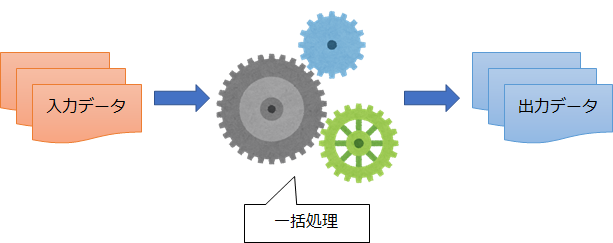

第1章 バッチアプリケーションとは何か？
=====

[↑目次](../README.md "目次")

プログラミングの説明に入る前に、まずバッチアプリケーションとはどのようなもので、どんな特徴があるのかを学んでいきましょう。

バッチアプリケーションとは？
-----

そもそも「バッチアプリケーション(batch application)」とは何でしょうか？

"batch"を英和辞書で引くと、次のように説明されています。

> batch
> 
> 【他動】  
> ～を1回分にまとめる  
> 【名】  
>  一束、一団、1回分、ひとまとまりの数量、束、群れ  
> 〔パン・菓子などの〕一窯分、一焼き分  
> ・I worked on a batch of loaves before lunch. : 私は昼食前にパン一焼き分に取り組んだ。  
> 《コ》バッチ処理、一括処理◆【同】batch processing
>
> [batchの意味・用例｜英辞郎 on the WEB：アルク](https://eow.alc.co.jp/search?q=batch)

この中の「～をひとまとまりにまとめる」や「一束」などの意味から、バッチアプリケーションとは「ひとまとまりの処理を一括で行うアプリケーション」と言えます。具体的には、商品の在庫情報から資産価値を計算したり、月間の勤怠情報から給与を計算したりといった処理を行います。

図1-1 バッチアプリケーションの処理イメージ

バッチアプリケーションの特徴
-----

バッチアプリケーションの特徴は次の3つです。

- 画面を持たない
- 即時性がない
- 繰り返し実行される

### 画面を持たない

普段私たちが目にするアプリケーションは、画面に文字やテキストボックスなどが並び、それらをマウス、キーボード、タッチなどで操作します。こういった画面を持つアプリケーションは「GUI(**G**raphic **U**ser **I**nterface)アプリケーション」と呼ばれます。

それに対して、バッチアプリケーションは画面を持たずに、「コマンドプロンプト」や「PowerShell」といった「コンソール」上で動作します。こういった画面を持たないアプリケーションは「コンソールアプリケーション」または「CLI(**C**ommand **L**ine **I**nterfaceアプリケーション」と呼ばれます。画面を持たないため、データの入出力はコマンドラインやファイルを使って行います。

画面を持たないことの利点として、ユーザーの入力が不要なので自動で実行することができますし、画面表示に関する余計な処理の負担を軽減できます。

### 即時性がない

バッチアプリケーションはあるまとまった単位で処理を行うことから、ユーザーの入力をもとにすぐに処理を行うという即時性はありません。その代わりに、次のようなタイミングで定期的に実行されるように設定されることが多くあります。

- 日/週/月/年に1回実行
- データ追加を監視して実行

その他、即時性はないがユーザーの指示によって実行するケースもあり、こちらは「オンライン・バッチ処理」とも呼ばれます。例えば、重要な年次処理を確認後に実行する、といった用途があります。

### 繰り返し実行される

前述のとおり定期的に実行されるため、バッチアプリケーションは何度も繰り返し実行されることが前提になります。したがって、一度実行して途中で処理に失敗した場合、データを見直して再度実行する必要があります。

こういったケースでは、途中までの処理結果を全部破棄して最初からやり直すか、途中までの処理結果を保存しておいて途中から再開するかして、再度実行してもデータの不整合が起きないようにします。

このように何度実行しても同じ入力なら処理結果が変わらない特性を「冪等性(べきとうせい)」といいます。

- - -

バッチアプリケーションが何かが分かったところで、次の章からはプログラミング言語C#を使ってバッチアプリケーションを作成する方法を、順に学んでいきましょう。

[→ 第2章 コンソールアプリケーションを作ってみよう](02.md "第2章 コンソールアプリケーションを作ってみよう")