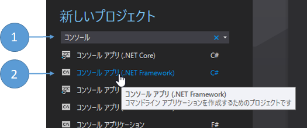
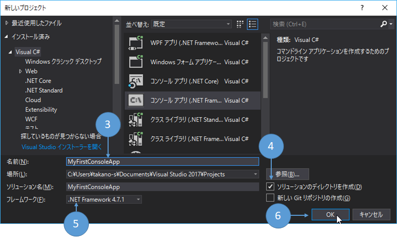
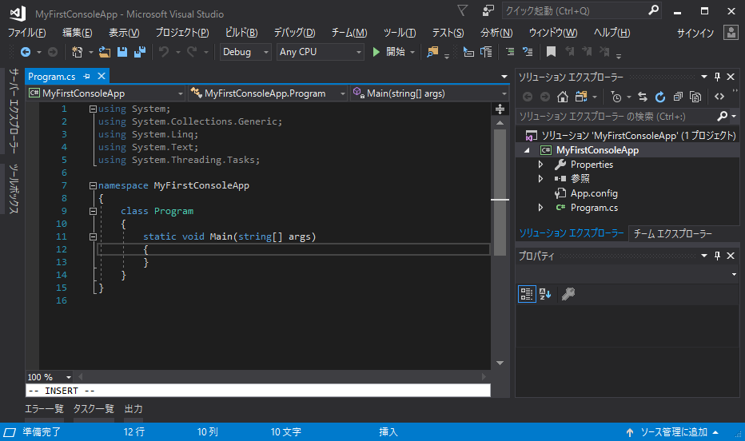
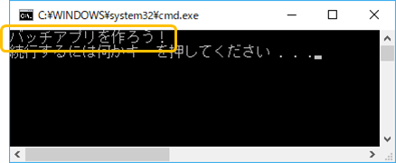

第2章 コンソールアプリケーションを作ってみよう
=====

[↑目次](../README.md "目次")

[← 第1章 バッチアプリケーションとは何か？](01.md "第1章 バッチアプリケーションとは何か？")

バッチプログラミングの第一歩として、最もシンプルなコンソールアプリケーションの作成方法から学んでいきましょう。

今回は.NET Frameworkで動くコンソールアプリケーションを、C#を使って作成します。Visual Studioを起動して次に進みましょう。

コンソールアプリケーションプロジェクト作成
-----

次の手順でコンソールアプリのプロジェクトを作成します。

1. ［スタートページ］の［新しいプロジェクト］欄のテキストボックスに"コンソール"と入力します

2. ［コンソールアプリ (.NET Framework) C#］をクリックします



図2-1 プロジェクトテンプレートの選択

3. ［名前］に任意の名前を入力します(例では"MyFirstConsoleApp")

4. ［ソリューションのディレクトリを作成］にチェックを付けます  

5. ［フレームワーク］は2018年4月現在で最新の［.NET Framework 4.7.1］を選択します。

6. ［OK］ボタンをクリックします。



図2-2 新しいプロジェクトの作成

コンソールアプリケーションプロジェクトが作成されました。



図2-3 作成されたコンソールアプリケーションプロジェクト


コンソールアプリケーションプロジェクトの構成
-----

コンソールアプリケーションプロジェクトの構成は、［ソリューション エクスプローラー］を見ると次のようになっています。

```
ソリューション
|
+- プロジェクト
   |
   +- Properties
   |  |
   |  +- AssemblyInfo.cs    アセンブリ情報ファイル
   |
   +- App.config            アプリケーション構成ファイル
   |
   +- Program.cs            プログラムコードファイル
```

### アセンブリ情報ファイル

コンソールアプリケーションプロジェクトをビルドすると、Windowsの実行形式ファイルである「exe」ファイルが作成されます(既定ではプロジェクト名.exe)。.NETではビルド成果物を「アセンブリ」と呼んでおり、このexeファイルのアプリケーション名や開発元、バージョン情報などを記載しています。

### アプリケーション構成ファイル

ビルド時ではなくアプリケーション実行時に指定したい設定情報を「構成情報」といいます。アプリケーション構成ファイルはその構成情報を記載します。例えば、アプリケーションが通信するサーバー名などを記載するのに使います。

### プログラムコードファイル

作成するコンソールアプリケーションの処理を書くためのファイルです。既定では`Program.cs`ファイルしか作成されませんが、必要に応じてコードファイルを追加しても構いません。


プログラムコードファイルの構成
-----

それでは、コンソールアプリケーションのコードファイルの構成を見ていきましょう。プロジェクト作成直後の`Program.cs`ファイルは、次のようになっています。

リスト2-1 既定の`Program.cs`ファイル

```csharp
using System;
using System.Collections.Generic;
using System.Linq;
using System.Text;
using System.Threading.Tasks;

namespace MyFirstConsoleApp
{
    class Program
    {
        static void Main(string[] args)
        {
        }
    }
}
```

コードファイル内には一つの`Program`クラスの中に、一つだけクラスメソッド`Main`が定義されています。このMainメソッドは**エントリポイント**と呼ばれ、このメソッドの先頭からコンソールアプリケーションの処理が始まります。

なお、Mainメソッドのシグネチャについては、後の章で詳しく見ていくのでここでは無視してください。


プログラムコード作成
-----

それでは、コンソールアプリケーションの処理を書いていきましょう。今回は、実行すると「バッチアプリを作ろう！」と出力するプログラムを作成します。

`Program.cs`ファイルの`Main`メソッドに、次のように`Console.WriteLine("バッチアプリを作ろう！");`と入力してください（`+`は追加した行を表しているので、入力する必要はありません)。

リスト2-2 プログラムコード追加

```csharp
// ... 略
static void Main(string[] args)
{
    Console.WriteLine("バッチアプリを作ろう！");  // <-追加
}
// ... 略
```

コードを入力し終わったら、`Ctrl`+`F5`キーを押して、「デバッグなしで開始」してください。次のように、コマンドプロンプトが起動してプログラムが実行され、「バッチアプリを作ろう！」と出力されればOKです。「続行するには何かキーを押してください . . .」はVisual Studioによって出力されているので、表示されていても問題ありません。指示のとおり何かキーを押すと、プログラムが終了します。



図2-4 プログラムの実行結果


コンソールアプリケーションの出力
-----

プログラムを実行したら「バッチアプリを作ろう！」と表示されました。このように、コンソール上にテキストを出力する仕組みを「標準出力(Standard output)」といいます。つまり、前述の`Console.WriteLine`メソッドは、「標準出力に引数で指定したテキストを1行書き込む」という処理を行うためのメソッドだったのです。

このように、画面のないコンソールアプリケーションでは、処理結果を出力するための手段の一つとして標準出力を使います。

- - -

コンソールアプリケーションの作り方が分かったところで、次の章からは複雑な処理を行うバッチアプリの作り方を学んでいきましょう。

[→ 第3章 バブルソートを実装してみよう](03.md "第3章 バブルソートを実装してみよう")