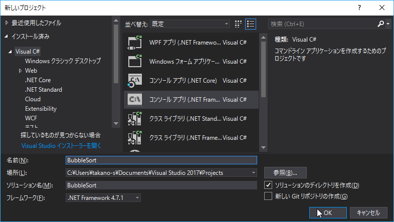
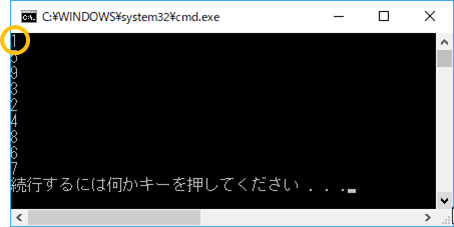
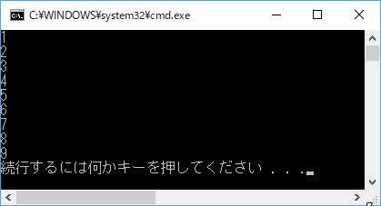

第3章 バブルソートを実装してみよう
=====

[↑目次](../README.md "目次")

[← 第2章 コンソールアプリケーションを作ってみよう](02.md "第2章 コンソールアプリケーションを作ってみよう")

コンソールアプリケーションの作成になれるため、まずは基本的なソートアルゴリズムの一つである「バブルソート」を行うプログラムを作ってみましょう。


プログラムの設計
-----

ただバブルソートを行うプログラムを作るとはいえ、どのように作るかを先にある程度考えなくてはなりません。

- ソート対象値は文字列か数値か
- ソート対象値はどうやって渡すか
- 複数の値をどうやって保持するか
- 結果をどのように出力するか

今回は最も簡単な形で、次のようにすることにしましょう。

- ソート対象値は整数
- ソート対象値はソースコード中に書く
- 値は配列で保持する
- 結果はソートした先頭の値から標準出力に書き出す


プロジェクトの作成
-----

それではプログラミングに入っていきましょう。まずは前章と同様の手順で、プロジェクトを作成します。プロジェクト名は「BubbleSort」としましょう。



図3-1 プロジェクトの作成


入力値の定義
-----

次にソート対象値を定義しましょう。今回は整数の配列として、配列初期化子を使って定義します。

リスト3-1 ソート対象値の定義
```csharp
// ... 略
static void Main(string[] args)
{
    var source = new[] { 5, 9, 3, 1, 2, 8, 4, 7, 6 };
}
// ... 略
```

変数名のsource（ソース）は「もと、源」というような意味があり、何らかの処理対象をあらわす名前としてよく使われます。


ソート処理実装
-----

次にバブルソートの実装に入ります。まずは、1ラウンド目の処理を実装し、複数ラウンド行うように変えていきましょう。

### 1ラウンド目

バブルソートの1ラウンド目は、次のような動作になるのでしたね。

1. 数列の右端と左隣の値を比べ、右側が小さいなら交換する
2. 基準の位置を1つ左に移動し、同じように左隣と比べて交換する
3. 基準の位置が左端に到達するまで1,2を繰り返す

今回は配列の先頭を左端、末尾を右端として扱い、上記の処理を行います。

まず、基準の位置を右端から左端に移動させることを考えましょう。これを配列で考えると、配列の末尾から先頭に基準の位置が移動するといえます。これをコードで表すと、一時変数名を`i`として、末尾`source.Length - 1`から先頭`0`まで、`i`をデクリメントさせながら繰り返す`for`文になります。

リスト3-2 右端から左端までの繰り返し

```csharp
// 末尾から先頭まで繰り返す
for (var i = source.Length - 1; i > 0; i--)
{
}
```

次に繰り返しの中で、2つの値を比較して交換する処理を実装しましょう。まず、基準位置の値を`right`、左隣の値を`left`として変数に代入します。

リスト3-3 比較対象値の取得

```csharp
for (var i = source.Length - 1; i > 0; i--)
{
    // 比較対象値を取得
    var right = source[i];
    var left = source[i - 1];
}
```

そして、leftとrightを比較し、rightが小さければ、基準位置にleft、左隣にrightを代入することで、交換します。

リスト3-4 値の交換

```csharp
for (var i = source.Length - 1; i > 0; i--)
{
    // ... 略

    if (left > right)
    {
        // 小さいほうを左側にする
        source[i] = left;
        source[i - 1] = right;
    }
}
```

### 結果出力

ここで1ラウンド終わった状態を確認するため、ソート結果の出力を先に実装してしまいましょう。

ソート処理の結果は、各要素の順番が分かりやすいよう、要素ごとに標準出力に1行ずつ書き込むようにしましょう。配列の要素すべてに対して処理を行うので、`foreach`文を使います。

リスト3-5 結果の出力

```csharp
// ... 略

for (var i = source.Length - 1; i > 0; i--)
{
    // ... 略
}

foreach (var item in source)
{
    Console.WriteLine(item);
}
```

ここで実行してうまく動いているか確認してみましょう。`Ctrl`+`F5`キーを押して実行し、次のような結果が得られればOKです。一番小さい値である1が先頭に来ていることが確認できますね。



図3-2 1ラウンドの実行結果


### ラウンドの繰り返し

次にソートが終わるまで複数回ラウンドを繰り返すようにしましょう。

考え方は、1ラウンド終わったら、先頭位置を確定済み扱いにして、また末尾から比較、交換を繰り返すというものでしたね。これを今回のコードに反映させるために、確定位置をあらわす変数`fixedIndex`を導入し、比較・交換処理対象範囲の下限にします。

リスト3-6 確定位置をあらわす変数導入

```csharp
// ... 略

var fixedIndex = 0;

// 末尾から確定位置まで繰り返す
for (var i = source.Length - 1; i > fixedIndex; i--)
{
    // ... 略
}

// ... 略
```

次にこの確定位置を0から順番に増やしていくことで、確定位置を先頭から末尾の手前まで順に移動させます。`while`文でも`for`文でもよいですが、初期値と終了条件が分かっているので、今回は`for`文を使いましょう。

リスト3-7 確定位置を順に移動させる

```csharp
// 確定位置を先頭から末尾の手前まで順に移動させる
for (var fixedIndex = 0; fixedIndex < source.Length - 1; fixedIndex++)
{
    for (var i = source.Length - 1; i > fixedIndex; i--)
    {
        // ... 略
    }
}
```

実行して次のように1～9まで順に並べばOKです。



図3-3 バブルソートの実行結果


完成コード
-----

バブルソートの完成コードは次の通りです。

リスト3-8 バブルソートの完成コード

```csharp
static void Main(string[] args)
{
    var source = new[] { 5, 9, 3, 1, 2, 8, 4, 7, 6 };

    // 確定位置を先頭から末尾の手前まで順に移動させる
    for (var fixedIndex = 0; fixedIndex < source.Length - 1; fixedIndex++)
    {
        // 末尾から確定位置まで繰り返す
        for (var i = source.Length - 1; i > fixedIndex; i--)
        {
            // 比較対象値を取得
            var right = source[i];
            var left = source[i - 1];

            if (left > right)
            {
                // 小さいほうを左側にする
                source[i] = left;
                source[i - 1] = right;
            }
        }
    }

    foreach (var item in source)
    {
        Console.WriteLine(item);
    }
}
```


演習問題
-----

1. 選択ソートを実装してみよう  
   プロジェクト名は「SelectionSort」とする
2. 挿入ソートを実装してみよう  
   プロジェクト名は「InsertionSort」とする


- - - - -

基本的な処理を行い、結果を標準出力に書き込むことができるようになりました。次の章では、処理対象データを外部から入力してみましょう。

[→ 第4章 バッチアプリケーションにデータを渡してみよう](04.md "第4章 バッチアプリケーションにデータを渡してみよう")