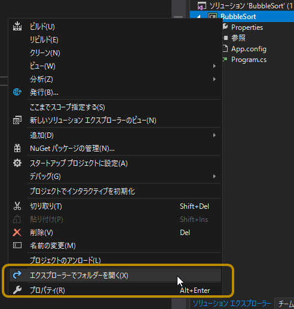
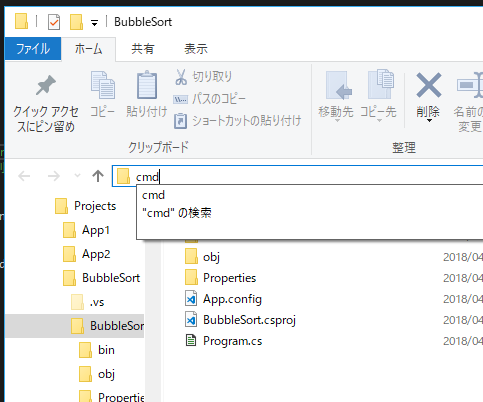
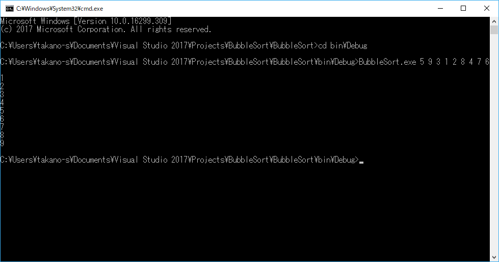
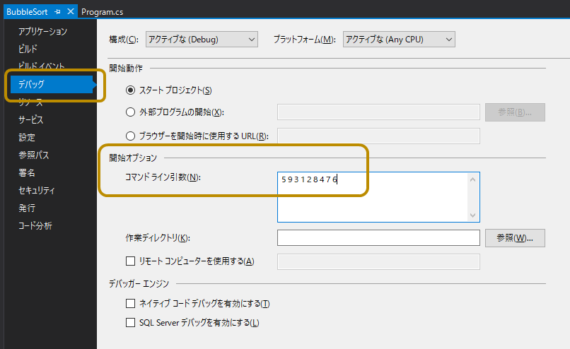
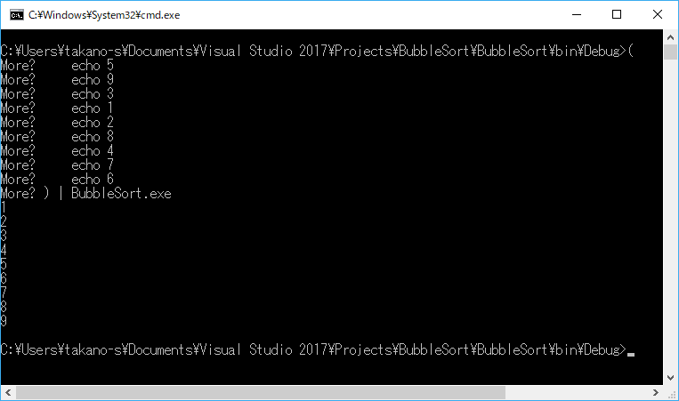

第4章 バッチアプリケーションにデータを渡してみよう
=====

[↑目次](../README.md "目次")

[← 第3章 バブルソートを実装してみよう](03.md "第3章 バブルソートを実装してみよう")

第3章で作成したアプリケーションでは、ソースコード中に書いたデータしかソートできないため、汎用性がありません。そこで、外部からソート対象のデータをアプリに引き渡す方法について学びましょう。


バッチアプリケーションへの入力方法
-----

バッチアプリケーションにデータを渡す手段としては、主に次の3つがあります。

- コマンドライン引数
- 標準入力
- ファイル入力

これらのうち、ファイル入力は後の章で改めて扱いますので、ほかの2つについて順に説明します。


コマンドライン引数
-----

アプリケーションをコマンドラインで実行する際、実行対象アプリのファイル名の後、空白で区切って入力データを指定する方法です。

例えば、Windowsの`cd`コマンドは、コマンドライン引数で移動先のフォルダーを指定します。コマンドライン引数を指定しない場合は、標準出力に現在のフォルダー名を出力します。

```
C:\>cd Windows

C:\Windows>cd
C:\Windows
```

C#でコマンドライン引数を扱うには、`Main`メソッドの引数`string[] args`を使います。空白区切りで指定したコマンドライン引数は、それぞれの値を要素として持つ、`string`型の配列として`Main`メソッドに渡されます。

リスト 4-1 コマンドライン引数の受け取り方

```csharp
static void Main(string[] args)
{
    var length = args.Length; // コマンドライン引数の数を取得
    var arg1 = args[0];       // 最初に指定したコマンドライン引数を取得
}
```

それでは、前の章で作成したバブルソートの入力データを、次のように空白区切りでコマンドライン引数から渡せるようにしてみましょう。

```
> BubbleSort.exe 5 9 3 1 2 8 4 7 6
```

### 引数の変換

コマンドライン引数は前述のとおり`string`型の配列なので、`int`型の配列に変換が必要です。`int`型の配列に変換するには、`int`型の`Parse`メソッドと、LINQの`Select`、`ToArray`メソッドを組み合わせます。なお、コマンドライン引数を指定しなかった場合などの処理は、エラー処理の章で改めて対応しますので、今は無視してください。

リスト4-2 引数の変換

```csharp
static void Main(string[] args)
{
    var source = args               //                          string[]型
        .Select(x => int.Parse(x))  // 配列の要素をint型に変換 => IEnumerable<int>型
        .ToArray();                 // 変換結果を配列にする    => int[]型

    // ... 略
}
```

LINQの`Select`メソッドは、配列などのコレクションの要素を一つ取り出して、引数で渡した「関数」で何かしらの変換処理を行います。今回は`string`型のコマンドライン引数を一つずつ取り出して`x`という一時変数に受け取り、`int`型の`Parse`メソッドで`int`型に変換しています。このような`x => xを使った変換処理`という形の記法は「ラムダ式」と呼ばれます。

`Select`メソッドの結果は`IEnumerable<T>`型という何かしらの「列挙できる」という性質をあらわすインターフェース型になり、このままでは使えないので、`ToArray`メソッドで配列に変換します。今回は、`Select`メソッドのラムダ式で指定した変換処理の結果が`int`型になるため、`Select`メソッド自体の戻り値は`IEnumerable<int>`型になります。これを`ToArray`メソッドで処理することで、`int`型の配列に変換します。

なお、`Select`メソッドの内部で`x`変数だけを引数に取る関数を呼び出すだけの時は、次のように直接その関数名を書くだけでもOKです。

リスト4-3 簡略化した引数の変換

```csharp
static void Main(string[] args)
{
    var source = args
        .Select(int.Parse)
        .ToArray();

    // ... 略
}
```

### テスト実行

それでは、引数で入力データが渡せることを、実際に実行して確認しましょう。コマンドライン引数を指定して実行するため、コマンドプロンプトから実行してみましょう。

まず、VSのソリューションを右クリックし、［エクスプローラーでフォルダーを開く］をクリックします。



図4-1 エクスプローラーでフォルダーを開く

ソリューションファイル`BubbleSort.sln`ファイルがあるフォルダーがエクスプローラーで開くので、`Alt`+`D`キーを押すかアドレスバーをクリックしてカーソルを移動後に、"cmd"(コマンドプロンプトの実行ファイル`cmd.exe`拡張子を除いたファイル名)を入力して`Enter`キーを押します。



図4-2 コマンドプロンプト起動

現在のフォルダーでコマンドプロンプトが開くので、`cd bin\Debug`コマンドを実行して、ソースコードのビルド成果物フォルダーに移動します。

そして、`BubbleSort.exe`にコマンドライン引数でソート対象データを指定して実行すると、ソート結果が出力されます。



図4-3 コマンドライン引数の実行結果

なお、`Ctrl`+`F5`キーなどで実行する際にコマンドライン引数を渡したい場合は、プロジェクトのプロパティページにて［デバッグ］タブを選択し、［開始オプション］－［コマンドライン引数］に指定することで可能です。



図4-4 VS上でのコマンドライン引数指定


標準入力
-----

処理対象のデータ数が少ない場合はコマンドライン引数でもよいですが、実際はもっと多くのデータを処理したいケースがほとんどでしょう。

そういったケースでは、「標準入力」を使うことができます。標準入力は標準出力とは逆で、改行区切りの文字列データをコンソールアプリケーションで受け取るための仕組みです。2つのコマンドを`|`(パイプ)記号でつなげて実行することで、前のコマンドの標準出力を後のコマンドの標準入力として引き渡すことができます。

例えば、次のように`dir`コマンドの結果を、`find`コマンドで絞り込むといった形で使います。例では、`C:`ドライブのファイル、フォルダーの中から、"Program"を含むものを絞り込んで出力しています。

```
C:\>dir | find "Program"
2018/04/04  13:20    <DIR>          Program Files
2018/04/04  13:50    <DIR>          Program Files (x86)
```

C#で標準入力を扱うには、`System.Console`クラスの`In`クラスプロパティを使います。`In`クラスプロパティは[`TextReader`型](https://msdn.microsoft.com/ja-jp/library/system.io.textreader.aspx)で、次のようなメソッドを使ってその内容を読み取ることができます。

- `ReadLine`メソッド  
  1行ずつ読み取る
- `Read`メソッド  
  1文字ずつ読み取る
- `ReadToEnd`メソッド  
  すべて読み取る

今回は行単位に読み取って処理するため、次のように`ReadStdIn`メソッドを定義して使います。

リスト 4-4 標準入力の読み取り

```csharp
static void Main(string[] args)
{
    var source = ReadStdIn()        // 標準入力から1行ずつ読み取る
        .Select(x => int.Parse(x))  // 配列の要素をint型に変換
        .ToArray();                 // 変換結果を配列にする

    // ... 略
}

private static IEnumerable<string> ReadStdIn()
{
    string s;
    while((s = Console.In.ReadLine()) != null)
    {
        // データがなくなるまで、順次標準入力の内容を1行ずつ返す
        yield return s;
    }
}
```

`yield return`キーワードは`IEnumerable<T>`型を返すメソッドで使える特殊なキーワードで、ループの中で使うことで、順次`T`型の要素を呼び出し元に返すことができます。その結果はコマンドライン引数の時と同様にLINQで処理することができます。

### テスト実行

それでは、実行して結果を確認してみましょう。複数行の標準入力をコマンドプロンプトから再現するには、次のように`(`、`)`で複数回の`echo`コマンドを実行し、それを`|`で`BubbleSort.exe`に渡します。

```
(
    echo 5
    echo 9
    echo 3
    echo 1
    echo 2
    echo 8
    echo 4
    echo 7
    echo 6
) | BubbleSort.exe
```



図4-5 標準入力の実行結果

または、次のように処理対象データが記載されたテキストファイルを用意し、`type`コマンドを使って標準出力に出して、その後`|`で渡します。

source.txt

```
5
9
3
1
2
8
4
7
6
```


図4-6 `type`コマンドの利用


演習問題
-----

1. 選択ソートをコマンドライン引数で入力データを渡すようにしてみよう
2. 挿入ソートを標準入力で入力データを渡すようにしてみよう


- - - - -

コンソールアプリケーションにデータを渡す2つの方法が分かりましたので、次の章からファイルを扱う方法を学んでいきましょう。

[→ 第5章 ファイルにデータを出力してみよう](05.md "第5章 ファイルにデータを出力してみよう")