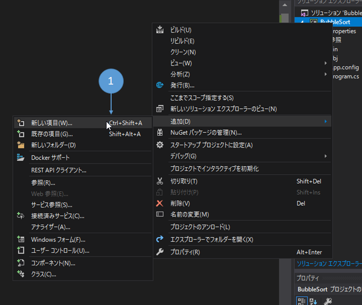
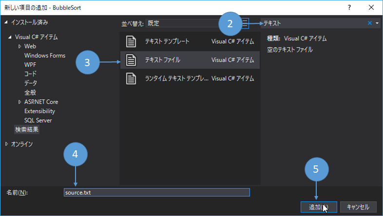
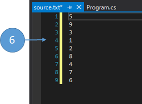
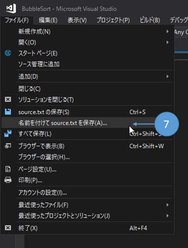
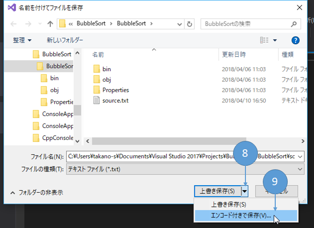
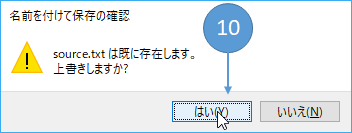
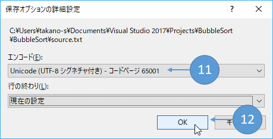
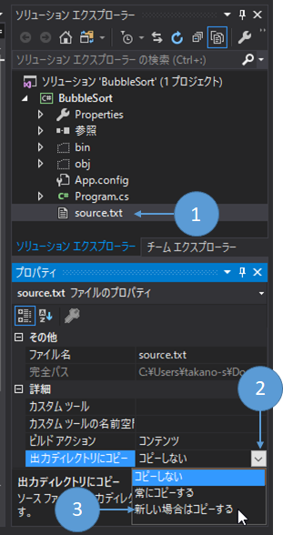
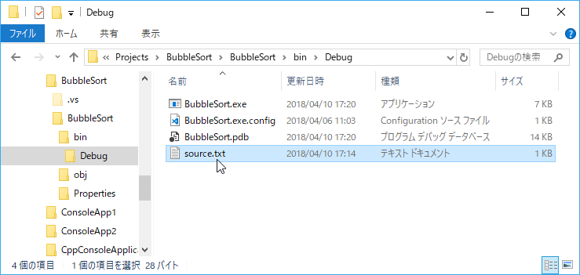
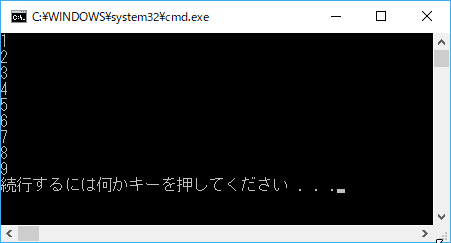

第5章 ファイルからデータを入力してみよう
=====

[↑目次](../README.md "目次")

[← 第4章 バッチアプリケーションにデータを渡してみよう](04.md "第4章 バッチアプリケーションにデータを渡してみよう")

前章ではコマンドラインから入力データをバッチアプリケーションに渡す方法を学びました。しかし、実際のデータはもっと量が多いことがほとんどでしょう。そんなケースのために、ファイルから処理対象データを入力する方法を学びましょう。


テキストファイルとは
-----

バッチアプリケーションで利用するファイルは主に「テキストファイル」です。テキストファイルとはその名の通り「文字」が連なった「テキスト」を格納したファイルです。

では、「テキスト」とは何でしょうか？コンピューターが扱えるデータは、0/1からなる2進数であり、「A」、「あ」といった文字をそのまま扱うことはできません。したがって、それぞれの文字をあらわす0/1の連なりを取り決めておかなくてはなりません。

### 文字コード

文字と0/1のデータの対応関係を取り決めたものが「文字コード（または文字エンコーディング）」です。最も基本的な「ASCII」（読み方：アスキー）という文字コードの場合、アルファベットや数字、記号などを、0～127の整数（2進数では0000 0000～0111 1111、16進数では0x00～0x7f）に対応付け、128種の文字を表すことができます。例えば、「ABC」というテキストは、「0100 0001 0100 0002 0100 0003（0x41 0x42 0x43)」という24bit=3バイトのデータとして表されます。

そして、ASCIIコードはアルファベットや数字、記号しか表現できませんが、私たち日本人は「かな」、「カナ」、「漢字」などの文字も当然データとして扱いたいですよね？そのため、日本語を扱える文字コードも当然あります。ただ、歴史的な経緯によって、いくつか種類があります。主なものは次の4つです。

- Shift-JIS（シフトJIS）  
  JIS(日本工業規格)で定められた文字を表現するための文字コード  
  日本語Windowsの既定の文字コード
- EUC-JP  
  UNIX(ユニックス) OSで日本語を表現するために定められた文字コード  
  現在ではあまり使われていない
- UTF-8  
  日本語だけでなくあらゆる文字を一つのルールで表現できるよう規格化されたUnicode（ユニコード）の一つ  
  ASCIIコードの範囲の文字は1バイト、それ以外の文字は2バイト以上(日本語は3バイト以上使うことが多い)で表現する
- UTF-16  
  UTF-8と同じUnicodeの仲間
  ASCIIコードの範囲の文字は2バイト、それ以外の文字は2バイト以上で表現する

このように、ファイル内のデータを文字として認識するためには、事前に文字コードを取り決めておく必要があります。

### 改行コード

文字をデータで表す方法は文字コードで取り決めましたが、文章の中には目に見える文字ではないものもあります。その中の一つが「改行」です。

改行をデータとして扱うには、ASCIIコードに含まれる「制御文字」の中の次の2つを使います。

- CR:キャリッジリターン (13、0000 1101、0x0d)
- LF:ラインフィード (10、0000 1010、0x0a)

実際に改行をあらわすには、上記の2つの制御コードを組み合わせて使いますが、こちらも歴史的経緯で次の3種類が使われます。

- CR+LF  
  CRとLFを2つつなげて表現する  
  Windowsの既定の改行コード
- LF  
  LFのみで表現する  
  UNIX、Linux、macOSの既定の改行コード
- CR  
  CRのみで表現する  
  昔のMacOS（バージョン9以前)の既定の改行コード

### BOM

その他、Unicodeの仲間の文字コードの場合、その他の文字コードでないことを表す必要があります。また、Unicodeでは複数バイトを使って文字を表現することがよくあり、そのデータ列をどの順番でコンピューターが読み書きすればよいかを指示する必要もあります。

この2つの目的でファイルの先頭に書き込まれる「文字ではないデータ列」を「BOM(**B**yte **O**rder **M**ark)：ボム、バイトオーダーマーク」と呼びます。BOMはUnicodeの種類ごとに、次のような値を書き込みます。

- UTF-8(※)  
  16進数で0xEF 0xBB 0xBF
- UTF-16
    - BE(**B**ig **E**ndian、ビッグ・エンディアン) : 0xFE 0xFF  
      最上位のバイトが先に来ることを表し、「0x89 0x8a」（炎）という文字は「0x89 0x8a」というバイト列で表現される
    - LE(**L**ittle **E**ndian、リトルエンディアン) : 0xFF 0xFE  
      最下位のバイトが先に来ることを表し、「0x89 0x8a」（炎）という文字は「0x8a 0x89」というバイト列で表現される

（※：UTF-8だけはBOMなしでも良いが、読み込むときは明示的にBOMの有無を指定する必要あり）

プログラムでテキストファイルを扱うときは、文字コード、改行コード、BOMを明示的に指定して読み書きすることが求められます。指定しない場合は、プログラムが動作するOSの既定の設定が使われます。よって、前の章で`type`コマンドを使ってファイルの内容を標準入力に渡しているところでは、暗黙的にWindowsの既定の文字コード「Shift-JIS」および既定の改行コードCR+LFでファイルが保存されている必要がありました（Windowsに付属のテキストエディタ「メモ帳」でファイルを作成するとこの組み合わせになります）。


ファイルの読み込み
-----

テキストファイルがなんであるかが分かったところで、C#でテキストファイルを読み込む方法について学びましょう。

C#でテキストファイルを読み込むには、実はいろいろ手段が用意されています。その中で、最も基本的な`StreamReader`クラスを今回は使います。

### `StreamReader`クラス

[`StreamReader`クラス](https://msdn.microsoft.com/ja-jp/library/system.io.streamreader.aspx)は、`System.IO`名前空間に所属し、特定の文字コードを指定してテキストデータを読み込むための専用クラスです。そして、前章で登場した`TextReader`クラスのサブクラスでもあります。

`StreamReader`クラスを使ったテキストファイルの読み込みは、次のように行います。

リスト5-1 `StreamReader`クラスを使ったテキストファイル読み込み

```csharp
using (var streamReader = new StreamReader(対象ファイルパス, 文字コード))
{
    string line;
    while ((line = streamReader.ReadLine()) != null)
    {
        // 最終行まで順番に読み込む
    }
}
```

`StreamReader`クラスのコンストラクターでは、次のように対象ファイルと文字コードを引数で指定します。

- 対象ファイルパス : `string型`
  読み込みたいテキストファイルのパスを、絶対パス(例：`C:\path\to\source.txt`)または相対パス(例：`.\files\source.txt`)で指定する
- 文字コード : [`System.Text.Encoding`型](https://msdn.microsoft.com/ja-jp/library/system.text.encoding.aspx)  
  文字コードをあらわす型  
  `Encoding`クラスのクラスプロパティとして、各種文字コードが事前に定義されていて使用できる（例：[`Encoding.UTF8`プロパティ](https://msdn.microsoft.com/ja-jp/library/system.text.encoding.utf8.aspx))  
  ただし、Shift-JISは事前に定義されたプロパティがないため、[`GetEncoding`メソッド](https://msdn.microsoft.com/ja-jp/library/t9a3kf7c.aspx)を使って指定する(例：`Encoding.GetEncoding("Shift-JIS")`)

改行コードとBOMについては、自動で認識して適切に処理してくれるため、後は`TextReader`クラスと同様に、`Read`、`ReadLine`、`ReadToEnd`メソッドなどを使ってファイルを読み込みます。

### ファイル処理の後始末

次は`StreamReader`クラスを使った処理コードの中で登場した`using`文について説明しましょう。

C#からファイルを操作する際、C#の機能が直接ファイルを操作しているのかというとそうではありません。実際はWindowsなどのOSが提供するファイル操作機能を内部で「借りて」使っています。

C#の機能だけであれば、アプリが使ったメモリなどの資産(リソース)はC#がある程度勝手に後始末をしてくれる「GC(**G**arbage **C**ollect：ガベージコレクト)」という仕組みがあり、ほぼ何も考える必要はありません。しかし、上記のようにOSから「借りた」ものについては、明示的に後始末が必要です。

このような後始末のための仕組みが、[`IDisposable`インターフェイス](https://msdn.microsoft.com/ja-jp/library/system.idisposable.aspx)と[`using`文](https://docs.microsoft.com/ja-jp/dotnet/csharp/language-reference/keywords/using-statement)です。

`IDisposable`インターフェイスは、後始末をするための`Dispose`メソッドを持っており、`StreamReader`クラスもこの`IDisposable`インターフェイスを実装しています。したがって、処理が終わったら、`Dispose`メソッドを呼び出し、後始末をしなくてはなりません。

しかし、正常に処理が終わった場合に加え、入力チェックでエラーとなったり、例外が発生したりといったすべてのケースで`Disopose`メソッドを漏れなく呼び出すように実装するのは、間違いが起こりやすく思いのほか大変です。

そこで便利なのが`using`文です。`IDisposable`インターフェイスを実装した変数の初期化を`using`文と組み合わせて使うことで、`using`文のブロック(`{`と`}`で囲まれた範囲)を抜けるときに、自動的に`Dispose`メソッドを呼び出してくれるのです。

`IDisposable`インターフェイスを実装した型はファイル操作以外にも沢山あります。例えば、新しくウィンドウを作ったり、ネットワーク通信をしたり、グラフィックを書いたりといったOSの機能を使うものは大体実装していますので、そういう型を使うときは`using`文と組み合わせて使うことを忘れないようにしてください。

### BubbleSortへの組み込み

それでは、`StreamReader`クラスを実際に使ってみましょう。毎度おなじみの「BubbleSort」プログラムで、実行ファイルと同じところにある`source.txt`ファイル(文字コードUTF-8)を入力ファイルとして処理するようにしたのが、次のコードです。

リスト5-2 BubbleSortへのStreamReaderの組み込み

```csharp
using System;
using System.Collections.Generic;
using System.IO;    // Encodingクラスを使うために追加
using System.Linq;
using System.Text;

namespace BubbleSort
{
    class Program
    {
        static void Main(string[] args)
        {
            var source = ReadLines()        // テキストファイルから1行ずつ読み取る
                .Select(x => int.Parse(x))  // 配列の要素をint型に変換
                .ToArray();                 // 変換結果を配列にする

            // ... 略
        }

        private static IEnumerable<string> ReadLines()
        {
            using (var streamReader = new StreamReader(@".\source.txt", Encoding.UTF8))
            {
                string line;
                while ((line = streamReader.ReadLine()) != null)
                {
                    // データがなくなるまで、入力ファイルの内容を1行ずつ返す
                    yield return line;
                }
            }
        }
    }
}
```

このプログラムの動作を確認するために、テスト用の`source.txt`ファイルを作成しましょう。

1. `BubbleSort`プロジェクトを右クリックし、コンテキストメニューから［追加］－［新しい項目］を選択する(もしくは`Ctrl`+`Shift`+`A`キーを押します)



図5-1 新しい項目の追加

2. ［新しい項目の追加］ダイアログで、［検索］欄に"テキスト"と入力する
3. テンプレートが絞り込まれるので［テキスト ファイル］をクリックして選択する
4. ［名前］に"source.txt"と入力する
5. ［追加］ボタンをクリックする



図5-2 テキストファイルの追加

6. 作成された`source.txt`ファイルが開かれるので、次のようにテストデータを記入する

```
5
9
3
1
2
8
4
7
6
```



図5-3 テストデータの入力

7. 文字コードを指定して保存するため、［ファイル］メニューの［名前を付けて (ファイル名) を保存をクリックする



図5-4 名前を付けて保存

8. ［上書き保存］ボタンの右端の［▼］ボタンをクリックしてドロップダウンメニューを表示する

9. ［エンコード付きで保存］をクリックする



図5-5 エンコード付きで保存

10. 上書き保存の確認ダイアログで［はい］ボタンをクリックする



図5-6 上書き保存

11. ［エンコード］で［Unicode (UTF-8 シグネチャ付き) - コードページ 65001］(シグネチャ：BOMのこと)を選択する(改行コードを変更したい場合は［行の終わり］欄で選択する)
    

12. ［OK］ボタンをクリックする



図5-7 BOM付きUTF-8で保存

次に、作成した`source.txt`ファイルをビルドしたタイミングで実行ファイル`BubbleSort.exe`と同じフォルダーにコピーするよう設定しましょう。

1. ［ソリューション エクスプローラー］で`source.txt`ファイルをクリックして選択する

2. ［プロパティ ウィンドウ］で［詳細］－［出力ディレクトリにコピー］のドロップダウンボタンをクリックする

3. ［新しい場合はコピーする］をクリックして選択する



図5-8 ビルド時にコピー

ここでビルドすると、`BubbleSort.exe`と同じところに`source.txt`ファイルがコピーされることが確認できます。



図5-9 ビルド結果

では、実行して確認してみましょう。`Ctrl`+`F5`キーを押して実行した結果、`source.txt`ファイルの内容がソートされ、標準出力に書き出されるはずです。



図5-10 実行結果

演習問題
-----

1. 入力ファイル名をコマンドライン引数で渡せるようにしてみよう
2. 入力ファイルの文字コードを「Shift-JIS」にしてみよう
3. 選択ソート、挿入ソートの入力データをファイルから渡すようにしてみよう


- - - - -

#### ［コラム］`File.ReadLines`メソッド

今回作成した`ReadLines`メソッドとほぼ同じ動きをするメソッドが、.NET Frameworkには既に含まれており、それが[`File`クラスの`ReadLines`メソッド](https://msdn.microsoft.com/ja-jp/library/dd383503.aspx)です。このメソッドは引数にファイルパスとエンコーディングを受け取り、テキストファイルの各行を`IEnumerable<string>`型で返します。

`File.ReadLines`メソッドをBubbleSortで使うと、次のようになります。

リスト5-3 `File.ReadLines`メソッドを使ったBubbleSort

```csharp
static void Main(string[] args)
{
    var source = File.ReadLines(@".\source.txt", Encoding.UTF8) // ファイルの各行を読み込む
        .Select(x => int.Parse(x))  // 配列の要素をint型に変換
        .ToArray();                 // 変換結果を配列にする

    // ... 略
}
```

- - - - -

ファイルを読み込めるようになったので、次の章ではファイル出力の仕方を学びましょう。

[→ 第6章 ファイルにデータを出力してみよう](06.md "第6章 ファイルにデータを出力してみよう")