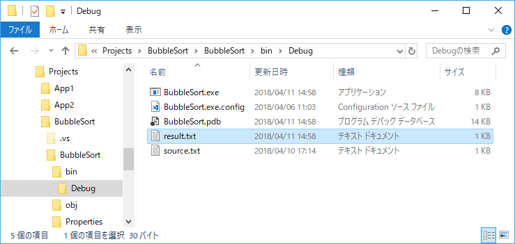
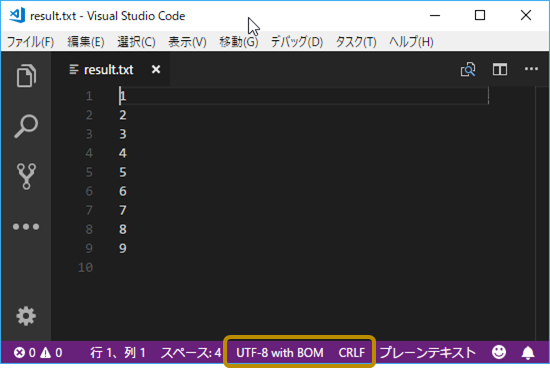

第6章 ファイルにデータを出力してみよう
=====

[↑目次](../README.md "目次")

[← 第5章 ファイルにデータを出力してみよう](05.md "第5章 ファイルにデータを出力してみよう")

前章に続いて、今度はテキストファイルに処理結果を出力する方法を学びましょう。


ファイルの書き出し
-----

C#でテキストファイルを書き出す手段も、読み取りと同様にいくつか用意されています。今回は`StreamReader`クラスと対になる`StreamWriter`クラスを紹介します。

### `StreamWriter`クラス

[`StreamWriter`クラス](https://msdn.microsoft.com/ja-jp/library/system.io.streamwriter.aspx)は、`System.IO`名前空間に所属し、特定の文字コードを指定してテキストデータを書き込むための専用クラスです。そして、たびたび登場している`TextReader`クラスと対になる`TextWriter`クラスのサブクラスでもあります。

`StreamWriter`クラスを使ったテキストファイルの書き込みは、次のように行います。

リスト6-1 `StreamWriter`クラスを使ったテキストファイル書き込み

```csharp
using (var streamWriter = new StreamWriter(対象ファイルパス, ファイルに追記するか否か, 文字コード))
{
    foreach (var line in lines)
    {
        // コレクションの要素を列挙し1行ずつ書き込む
        streamWriter.WriteLine(line);
    }
}
```

`StreamWriter`クラスのコンストラクターでは、次のように対象ファイルとファイルに追記するか否か、文字コードを引数で指定します。

- 対象ファイルパス : `string型`
  読み込みたいテキストファイルのパスを、絶対パス(例：`C:\path\to\source.txt`)または相対パス(例：`.\files\source.txt`)で指定する
- ファイルに追記するか否か : `bool`型  
  対象ファイルパスで指定したファイルが既に存在した場合、そのファイルの末尾に新たにデータを追記する場合は`true`、先頭から上書きする場合は`false`を指定する
- 文字コード : [`System.Text.Encoding`型](https://msdn.microsoft.com/ja-jp/library/system.text.encoding.aspx)  
  `StreamReader`クラスと同様に文字コードを指定する

改行コードを指定したい場合は、`StreamWriter`クラスの`NewLine`プロパティを設定します。

- `NewLine`プロパティ : `string`型  
  改行コードを文字列で指定する  
  ※既定値はOSの既定の改行コード(WindowsならCR+LF)
    - "\r" : CR
    - "\r\n" : CR+LF
    - "\n" : LF

BOMについては、`StreamWriter`クラスのコンストラクターに渡す文字コードで指定します。

- UTF-8  
  [`System.Text.UTF8Encoding`型](https://msdn.microsoft.com/ja-jp/library/s064f8w2.aspx)を使い、コンストラクター引数でBOMの有り無しを指定する  
  例：`new UTF8Encoding(false)`(BOMなし)
- UTF-16  
  [`System.Text.UnicodeEncoding`型](https://msdn.microsoft.com/ja-jp/library/984ebfcy.aspx)を使い、コンストラクターの第一引数でBEかどうかを指定する  
  例：`new UnicodeEncoding(false, true)`(LE)  
  ※第二引数は原則としてtrueで良い

`StreamWriter`クラスのオブジェクトを作った後は、次のようなメソッドを使い、ファイルにテキストデータを書き込みます。

- `Write`メソッド  
  値を書き込む
- `WriteLine`メソッド  
  1行書き込む
- `Close`メソッド  
  テキストデータを書き出してファイルを閉じる
- `Flush`メソッド  
  テキストデータをファイルに書き出す

この中で、`Flush`メソッドは少し特殊です。

`StreamWriter`クラスは`Close`メソッドを呼び出したとき、実際にファイルにテキストデータを書き出します。それまでは、`Write`、`WriteLine`メソッドで指定した内容はメモリ上に溜めてあります（これをバッファと呼びます）。

ただ、大量データを扱うような場合、ある区切りごと(例えば拠点ごとなど)にファイルにテキストデータを書き出してしまいたいケースがあります。そんな時は`Flush`メソッドを使うことで、バッファの内容をファイルに書き出すことができます。

なお、`StreamWriter`クラスも`StreamReader`クラスと同様に`IDisposable`インターフェイスを実装しています。`using`文を使って必ず`Dispose`メソッドが呼ばれるようにしましょう。

ちなみに、`StreamWriter`クラスの`Close`メソッドは`Dispose`メソッドと同じ処理になっているため、`Dispose`メソッドの呼び出しのタイミングで、`Close`メソッドを呼び出したことになり、ファイルにデータが書き出されます。

### BubbleSortへの組み込み

それでは、`StreamWriter`クラスを実際に使ってみましょう。実行ファイルと同じところにある`result.txt`ファイル(文字コードBOM付きUTF-8、改行コード既定)にソート結果を書き出すようにしたのが、次のコードです。

リスト6-2 BubbleSortへのStreamWriterの組み込み

```csharp
static void Main(string[] args)
{
    // ... 略

    using (var streamWriter = new StreamWriter(@".\result.txt", true, Encoding.UTF8))
    {
        foreach (var item in source)
        {
            // ソート結果を順番に書き込む
            streamWriter.WriteLine(item);
        }
    }
}
```

ビルドして実行すると、`BubbleSort.exe`と同じところに`result.txt`が作成されるのが確認できます。



図6-1 処理結果ファイル

`result.txt`ファイルを文字コードや改行コードが分かるテキストエディターで開くと、「BOM付きUTF-8、改行コードCRLF」であることが確認できます。



図6-2 result.txtの文字コードと改行コード


演習問題
-----

1. 出力ファイルパスをコマンドライン引数で渡すようにしてみよう
2. 出力ファイルの文字コードをShift-JIS、改行コードをLFにしてみよう


- - - - -

#### ［コラム］`File.WriteAllLines`メソッド

`File.ReadLines`メソッドが全部の行を順に読み込むように、全部の行を順に書き込むメソッドも、`File`クラスには用意されています。それが[`File.WriteAllLines`メソッド](https://msdn.microsoft.com/ja-jp/library/system.io.file.writealllines.aspx)です。このメソッドは引数にファイルパスと書き込む行データのコレクションおよびエンコーディングを受け取り、テキストファイルに書き込みます。

`File.WriteAllLines`メソッドをBubbleSortで使うと、次のようになります。

リスト5-3 `File.WriteAllLines`メソッドを使ったBubbleSort

```csharp
static void Main(string[] args)
{
    // ... 略

    File.WriteAllLines(
        @".\result.txt",
        source.Select(n => n.ToString()),
        Encoding.UTF8);
}
```

この例では、ソート結果の`source`変数が`int`型の配列なので、LINQの`Select`メソッドを使い、`IEnumerable<string>`型に変換して渡しています。

- - - - -

ファイルの入出力もできるようになったので、次の章からはより実践的なアプリケーションの作り方を学んでいきましょう。

[→ 第7章 2つのファイルを使って処理してみよう](07.md "第7章 2つのファイルを使って処理してみよう")