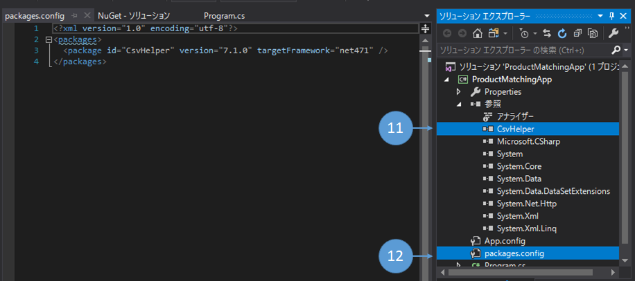
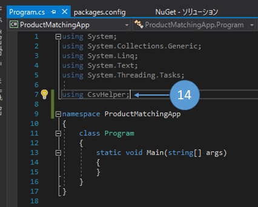

第7章 2つのファイルを使って処理してみよう
=====

[↑目次](../README.md "目次")

[← 第6章 ファイルにデータを出力してみよう](06.md "第6章 ファイルにデータを出力してみよう")

前章までで、ファイルの読み書きを含む基本的なバッチアプリケーションの作り方が分かりました。今度はより実践的なアプリの作り方を学んでいきましょう。

なお、本章の内容はこれまでの章の内容を組み合わせているため、少し難しくなります。適宜ブレークポイントで動きを止めるなどして、動作をしっかりと確認しながら進めるようにしてください。

アルゴリズムとデータ構造
-----

実践的なアプリを作るうえで、アルゴリズムとデータ構造は欠かせません。

ここで「アルゴリズム」と言っているのは「バブルソート」などの基本アルゴリズムを知っているということではありません。アプリの要件を実現するのに必要なアルゴリズムを、自ら生み出せるかどうかが大事です。 また、同じように、リストやスタックといった「データ構造」の仕組みを知っているだけでなく、要件を実現するためにどのデータ構造を活用するか判断できることも重要です。

そこで、今回は次のような要件を実現する多面、どのデータ構造を使ってどんなアルゴリズムを実装すればよいのか、チュートリアル形式で学んでいきましょう。

作成するアプリ
-----

販売データに対して商品情報をマッチングして出力します。

- 販売データと商品情報を入力する
    - 販売データの項目
        - 商品コード
        - 単価
        - 数量
        - 金額
        - 販売日
    - 商品情報
        - 商品コード
        - 商品名
        - 商品カテゴリー
- 販売データはランダムに並んでいる
- 販売日および商品カテゴリー、商品コード順に次の商品販売データを作りたい
    - 商品販売データ
        - 販売日
        - 商品コード
        - 商品名
        - 商品カテゴリー
        - 単価
        - 数量
        - 金額
- 入出力データはCSV(**C**omma **S**eparated **V**alue)形式のテキストファイルとする
    - CSV：`,`(カンマ)でそれぞれの項目が区切られたデータ形式
    - 文字コード：BOM付きUTF-8
    - 改行コード：CRLF


図7-1 アプリの処理イメージ


処理手順の検討
-----

アプリの要件からポイントを抜き出して、どのように処理するか検討していきましょう。

### 出力データはソートする必要がある

次の記述から、出力データは入力データ順ではなく、ソートする必要があることが分かります。

> - 販売データは**ランダムに並んでいる**
> - **販売日および商品カテゴリー、商品コード順に**次の商品販売データを作りたい

このことから、アプリでは次の処理を行う必要があります。

1. 出力データを一時的に蓄えておく
2. マッチング処理後に並び替える

上記の2つの処理をするのに適したデータ構造は何なのか考えてみましょう。

まず、入力データの個数は決まっていません。したがってあらかじめ要素の数が決まっている「配列」は今回は向いていないようです。

次に並び替えが可能であるということから、データを取り出す順番はあらかじめ決める必要がないことが分かります。したがって、「スタック」や「キュー」といったデータ構造も、今回は冗長なようです。

そう考えていくと、任意の数のデータが単に連続していればよいということが分かり、最終的に「リスト」を使うことが、今回適していると考えられます。

C#でリストを扱うには、そのものずばりの名前の[`List<T>`クラス](https://msdn.microsoft.com/ja-jp/library/6sh2ey19.aspx)があります。`List<T>`クラスにはデータをソートする手段も用意されているので、今回はこのクラスを使っていきましょう。

### 商品コードを使って商品情報を取り出す必要がある

出力する販売データには商品コードだけでなく商品のカテゴリ、名称も必要です。そのためには、販売データ入力ファイルの商品コードをもとに、商品データ入力ファイルの商品情報を取得する必要があります。

この商品情報を取得する際、毎回商品データ入力ファイルを読み込んで先頭から探すこともできます。しかし、それでは時間がかかりますし、CPUやメモリといったPCの資源(リソース)を無駄にしてしまいます。そのため、ほかの手段を考えたほうがよいでしょう。

ではどうするのがよいでしょう？今回のように「ある値をキーとして情報を取得する」のに向いたデータ構造があります。それがハッシュテーブル(ディクショナリとも呼ぶ)です。

C#ではハッシュテーブルを扱うには[`Dictionary<TKey, TValue>`クラス](https://msdn.microsoft.com/ja-jp/library/xfhwa508.aspx)を使います。アプリの処理の最初に、商品データ入力ファイルの情報を全部読み込み、`Dictionary<TKey, TValue>`クラスの変数に格納しておき、販売データの商品コードを使って商品情報を取り出すようにしましょう。

### CSVファイルを扱う必要がある

CSVは`,`(カンマ)でデータを区切るという、一見わかりやすく便利なデータ形式です。Excelを使って開くこともできますし、そのまま編集することもできます。

ただ、CSVファイルは`,`(カンマ)でデータを区切り、行単位でデータを扱うという都合上、次の面倒な問題を抱えています。

- データの中に`,`を含めたい  
  `,`があると一つのデータ項目が2つに分割されてしまう
- データの中に改行を含めたい  
  改行があるとそこで1行が終わったとみなされてしまう

これらの問題には、単にファイルを行単位で読み込んで、`,`で項目を分割するだけでは対処できません。したがって、次のような手段を取ります。

- - - - -

#### 項目を`"`(ダブルクォーテーション)で囲う

`,`や改行コードを含む項目があったら、その項目全体を`"`(ダブルクォーテーション)で囲って一つの項目として扱うようにします。

もちろんダブルクォーテーションを含んだデータも想定されるので、その場合は項目全体をダブルクォーテーションで囲ったうえで、データ中のダブルクォーテーションは`""`のように2つ重ねて表現します。

#### データは行単位でなくレコード単位で読み書きする

行単位ではなく、データとしての1行(これをレコードと呼ぶ)の終わりが明確になるところまでを単位としてファイルを読み書きします。

上記のように項目を`"`で囲うことで、行末が項目の内部かどうかを判断できるようになっているので、項目内部でない行末を見つけたら、そこまでを1つのレコードとして扱います。

- - - - -

さて、このようなCSVファイルの表現のルールは、「RFC(**R**equest **F**or **C**omments)」という提案書の一つ「[RFC 4180 : Common Format and MIME Type for Comma-Separated Values (CSV) Files](https://www.rfc-editor.org/info/rfc4180)」としてまとめられています。ただし、RFC 4180の一部でも自分で実装するのは非常に大変です。

こんな時は、先人たちが用意してくれた便利な「ライブラリ」を使いましょう。ライブラリとは機能をひとまとめにして提供されたモジュールであり、これまでに登場したC#の機能も、実は.NET Frameworkに含まれる標準ライブラリを利用していました。なお、.NETでは、ライブラリは「DLL(**D**ynamic **L**ink **L**ibrary：ダイナミックリンクライブラリ)」というアセンブリファイルで提供されます。

今回はCSVファイルを扱うのに特化した、[CSV helper](http://joshclose.github.io/CsvHelper/)というOSSライブラリを使いましょう。CSV helperは、上記のような面倒なCSVファイルの読み書きを代用してくれる便利なライブラリです。また、作者によってソースコードが公開され、規約(ライセンス)を守れば無償で使うことができます。こういったソフトウェアを(**O**pen **S**ource **S**oftware：オープンソースソフトウェア)」といい、世の中には多くのOSSが公開されています。


アプリ作成
-----

それでは、実際にアプリを作成していきましょう。新たに`ProductMatchingApp`というコンソールアプリケーションプロジェクトを作成してください。


図7-2 新しいプロジェクトの作成

### CSV helperの利用設定

最初に、前述のCSVファイル読み書きライブラリのCSV helperの利用設定をしましょう。

.NETには「NuGet」というツールがあり、これを利用すると[NuGet Gallery](https://www.nuget.org/)で公開されている各種のライブラリを、手軽に利用できます。なお、こういった、公開されたライブラリを管理するツールを、「パッケージマネージャー」と呼びます。

次の手順で、NuGet Galleryに公開されたCSV helperを、開発中のプロジェクトにインストールできます。

1. VSの［ツール］メニューをクリックする
2. ［NuGet パッケージ マネージャー］をクリックする
3. ［ソリューションの NuGet パッケージの管理］をクリックする


図7-3 NuGet パッケージマネージャーの起動

4. ［NuGet - ソリューション］ウィンドウにて［参照］タブをクリックして選択する
5. パッケージ名に"csvhelper"と入力し、検索する
6. "csvhelper"に一致するパッケージ一覧から［CsvHelper］をクリックして選択する
7. インストール先プロジェクトとして［ProductMatchingApp］のチェックを入れて選択する
8. ［インストール］ボタンをクリックする


図7-4 NuGet CSV helperのインストール

9. ［変更のプレビュー］ダイアログが表示されるので［OK］ボタンをクリックする


図7-5 変更のプレビュー

10. ［ライセンスへの同意］ダイアログが表示されるので、［同意する］をクリックする


図7-6 ライセンスへの同意

11. プロジェクトにCsvHeper.dllへの参照が追加される
12. インストールしたパッケージの内容が`packages.config`ファイルに記載される



図7-7 CSV helperインストール結果


13. インストールしたCSV helperのdllファイルは、ソリューションフォルダー内の`packages`フォルダーに格納される


図7-8 インストールしたパッケージの実体

14. C#のソースコードに`using CsvHelper:`を追加して、ライブラリをインポートする



図7-9 C#コードにインポート

### 商品情報用クラス作成

CSVファイルを扱う準備ができたので、次は商品情報を取り込むコードを書いていきましょう。

商品情報は前述のとおり`Dictionary<TKey, TValue>`クラスの変数で扱います。この時`TKey`型パラメータに指定する型は「商品コード」ですので`string`型でよいでしょう。では、`TValue`型パラメータはどうすればよいでしょうか？

最も原始的な方法は、なんでも入る魔法の箱である`object`型の配列を使うことです。しかし、それぞれの項目の値を使うとき、必ず明示的にキャストが必要になります。これでは間違った値を扱っても気づかず、不具合を生む温床となります。

したがって、正解は「商品情報をあらわす型を作成してそれを使う」になります。商品情報の項目に対応した名前と型のプロパティを持つ型を定義することで、コードの誤りをある程度防ぐことができます。

今回は、商品情報を扱うために`Product`クラスを作りましょう。

1. ［ソリューション エクスプローラー］にてプロジェクトを右クリックする
2. コンテキストメニューから［追加］をクリックする
3. ［クラス］をクリックする


図7-10 新しいクラスの作成

4. ［新しい項目の追加］ダイアログにて、［名前］に"Product.cs"と入力する
5. ［追加］ボタンをクリックする


図7-11 `Product`クラスの作成

6. `Product.cs`ファイルが作成され表示されるので、次のコードを入力する

リスト7-1 `Product`クラス

```csharp
class Product
{
    /// <summary>
    /// 商品コード
    /// </summary>
    public string Code { get; set; }

    /// <summary>
    /// 商品名
    /// </summary>
    public string Name { get; set; }

    /// <summary>
    /// 商品カテゴリー
    /// </summary>
    public string Category { get; set; }
}
```

コード中の`///`で始まるコメント行は「ドキュメントコメント」と呼ばれます。ドキュメントコメント中にXML形式で記載した内容は、コード補間時に表示されるので、できるだけ書くようにしましょう。

### 商品情報取り込み

商品情報用のクラスも準備できたので、いよいよCSVファイルから商品情報を取り込んでみます。

まず、CSVファイルからデータを読み込みます。商品データ入力ファイル名は`product.csv`として、CSV helperを活用して次のコードのように`IEnumerable<Product>`型として読み込みます(CSV helperのドキュメントから「[Reading](http://joshclose.github.io/CsvHelper/reading)」を参考にします)。

リスト7-2 商品情報読み込み

```csharp
class Program
{
    static void Main(string[] args)
    {
        // 商品データCSVファイルを読み込むためのStreamReaderオブジェクト作成
        using (var sr = new StreamReader(@".\product.csv", Encoding.UTF8))
        {
            // CSV helperで読み込み
            var csv = new CsvReader(sr);
            var products = csv.GetRecords<Product>();

            foreach (var product in products)
            {
                // ちゃんと読み込めているかテスト出力
                Console.WriteLine($"Code:{product.Code}, Name:{product.Name}, Category:{product.Category}");
            }
        }
    }
}
```

試しに[第五章](05.md)の要領で次のようなテストデータCSVファイル`product.csv`を作成して実行すると、カンマも改行もちゃんと扱えていることが確認できます。

product.csv

```csv
Code,Name,Category
0001,チョコレート,食品
0002,"カンマ(,)を含む商品",その他
0003,"改行
を含む商品",その他
```


図7-12 商品情報の読み込み結果

今度は読み込んだ商品情報を`Dictionary<string, Product>`クラスのオブジェクトに蓄えます。`IEnumerable<T>`型から`Dictionary<TKey, TValue>`型への変換は、LINQの[`ToDictionary`メソッド](https://msdn.microsoft.com/ja-jp/library/system.linq.enumerable.todictionary.aspx)が便利です。`ToDictionary`メソッドでは、ディクショナリの値となるオブジェクトからどのようにキーを取り出すかをラムダ式で指定します。今回の場合、商品情報の`Product`型オブジェクトから、商品コードである`Code`プロパティをキーとして使うよう指定しています。

リスト7-3 商品情報をディクショナリに変換

```csharp
static void Main(string[] args)
{
    // 商品データCSVファイルを読み込むためのStreamReaderオブジェクト作成
    using (var sr = new StreamReader(@".\product.csv", Encoding.UTF8))
    {
        // ... 略

        /* 使わないので削除する
        foreach (var product in products)
        {
            // ちゃんと読み込めているかテスト出力
            Console.WriteLine($"Code:<{product.Code}>, Name:<{product.Name}>, Category:<{product.Category}>");
        }
        */

        // ディクショナリに変換
        var productDictionary = products.ToDictionary(product => product.Code);
        foreach (var key in productDictionary.Keys)
        {
            // キーの一覧を列挙して対応する値をテスト出力
            var value = productDictionary[key];
            Console.WriteLine($"Key:<{key}, ProductName:<{value.Name}>");
        }
    }
}
```

テスト実行結果は次のようになります。


図7-13 商品情報のディクショナリ変換結果

商品情報取り込みがうまく動いていることが分かったので、取り込み処理はメソッドにまとめてしまいましょう。

まず、結果となる`productDictionary`変数の宣言と`foreach`している個所を、`using`ブロックの外に移動します。このとき、変数の宣言と同時に初期化しなくなるため、変数の型を`Dictionary<string, Product>`と明示しないといけないことに注意してください。

リスト7-4 `productDictionary`変数宣言の移動

```csharp
static void Main(string[] args)
{
    // usingブロックの外に移動
    Dictionary<string, Product> productDictionary;
    
    // 商品データCSVファイルを読み込むためのStreamReaderオブジェクト作成
    using (var sr = new StreamReader(@".\product.csv", Encoding.UTF8))
    {
        // CSV helperで読み込み
        var csv = new CsvReader(sr);
        var products = csv.GetRecords<Product>();

        // ディクショナリに変換
        productDictionary = products.ToDictionary(product => product.Code);
    }

    // usingブロックの外に移動
    foreach (var key in productDictionary.Keys)
    {
        // キーの一覧を列挙して対応する値をテスト出力
        var value = productDictionary[key];
        Console.WriteLine($"Key:<{key}, ProductName:<{value.Name}>");
    }
}
```

そして、`productDictionary`変数の宣言から`using`ブロックの終わりまで行選択して、`Ctrl`+`.`キーを押して［メソッドの抽出］を行います。


図7-14 商品情報取り込み処理をメソッド抽出

抽出したメソッド名は、「商品情報を取り込む」ことから`ImportProduct`とでもしておきましょう。そして、「メソッドの抽出」を行うために`using`ブロックの外に移動した`ImportProduct`メソッド内の`productDictionary`変数宣言は、そもそも変数宣言自体が不要になります。`ToDictionary`メソッドの結果を直接`return`してしまってかまいません。

リスト7-5 商品情報取り込みメソッド抽出結果

```csharp
private static Dictionary<string, Product> ImportProduct()
{
    // 削除
    // Dictionary<string, Product> productDictionary;

    // 商品データCSVファイルを読み込むためのStreamReaderオブジェクト作成
    using (var sr = new StreamReader(@".\product.csv", Encoding.UTF8))
    {
        // CSV helperで読み込み
        var csv = new CsvReader(sr);
        var products = csv.GetRecords<Product>();

        // ディクショナリに変換
        // 直接returnする
        // productDictionary = products.ToDictionary(product => product.Code);
        return products.ToDictionary(product => product.Code);
    }

    // 削除
    // return productDictionary;
}
```

最後に、`Main`メソッドの`productDictionary`変数の型宣言を`var`に戻してテスト実行し、図7-13と同じ結果になればOKです。テスト用の`foreach`文はもう不要なので、削除してしまってOKです。

リスト7-6 商品情報取り込みの最終コード

```csharp
class Program
{
    static void Main(string[] args)
    {
        var productDictionary = ImportProduct();

        /* 不要なので削除する
        foreach (var key in productDictionary.Keys)
        {
            // キーの一覧を列挙して対応する値をテスト出力
            var value = productDictionary[key];
            Console.WriteLine($"Key:<{key}, ProductName:<{value.Name}>");
        }
        */
    }

    private static Dictionary<string, Product> ImportProduct()
    {
        // 商品データCSVファイルを読み込むためのStreamReaderオブジェクト作成
        using (var sr = new StreamReader(@".\product.csv", Encoding.UTF8))
        {
            // CSV helperで読み込み
            var csv = new CsvReader(sr);
            var products = csv.GetRecords<Product>();

            // ディクショナリに変換
            return products.ToDictionary(product => product.Code);
        }
    }
}
```

### 販売データの取り込み

今度は販売データの取り込みに入っていきましょう。販売データも商品情報データと同様に、データを取り込むための専用クラスを次のように作ります。

リスト7-7 販売データ用クラス

```csharp
class Sales
{
    /// <summary>
    /// 商品コード
    /// </summary>
    public string ProductCode { get; set; }

    /// <summary>
    /// 単価
    /// </summary>
    public decimal UnitPrice { get; set; }

    /// <summary>
    /// 数量
    /// </summary>
    public decimal Quantity { get; set; }

    /// <summary>
    /// 金額
    /// </summary>
    public decimal Amount { get; set; }

    /// <summary>
    /// 販売日
    /// </summary>
    public DateTime SalesDate { get; set; }
}
```

販売データは、商品情報と合わせてリストとして扱いたいので、出力用のクラスも作っておきましょう。

リスト7-8 商品販売データ用クラス

```csharp
    class ProductSales
    {
        /// <summary>
        /// 商品コード
        /// </summary>
        public string ProductCode { get; set; }

        /// <summary>
        /// 商品名
        /// </summary>
        public string ProductName { get; set; }

        /// <summary>
        /// 商品カテゴリー
        /// </summary>
        public string ProductCategory { get; set; }

        /// <summary>
        /// 単価
        /// </summary>
        public decimal UnitPrice { get; set; }

        /// <summary>
        /// 数量
        /// </summary>
        public decimal Quantity { get; set; }

        /// <summary>
        /// 金額
        /// </summary>
        public decimal Amount { get; set; }

        /// <summary>
        /// 販売日
        /// </summary>
        public DateTime SalesDate { get; set; }
    }
```

これらのクラスをCSV helperと併せて使い、販売データを取り込み、リストに変換しましょう。この変換処理もメソッドとして定義します。

リスト7-9 販売データ取り込み

```csharp
static void Main(string[] args)
{
    var productDictionary = ImportProduct();

    var productSales = ImportSales();

    // 商品販売データをテスト出力
    foreach (var item in productSales)
    {
        Console.WriteLine(
            $"ProductCode: {item.ProductCode}, " +
            $"UnitPrice: {item.UnitPrice}, " +
            $"Quantity: {item.Quantity}, " +
            $"Amount: {item.Amount}, " +
            $"SalesDate: {item.SalesDate:yyyy/MM/dd}"
            );
    }
}

// ... 略

private static List<ProductSales> ImportSales()
{
    // 販売データCSVファイルを読み込むためのStreamReaderオブジェクト作成
    using (var sr = new StreamReader(@".\sales.csv", Encoding.UTF8))
    {
        // CSV helperで読み込み
        var csv = new CsvReader(sr);

        // 販売データを読み込む
        var sales = csv.GetRecords<Sales>();

        // 商品販売情報のリストに変換
        return sales.Select(item => new ProductSales
        {
            ProductCode = item.ProductCode,
            UnitPrice = item.UnitPrice,
            Quantity = item.Quantity,
            Amount = item.Amount,
            SalesDate = item.SalesDate
        })
        .ToList();
    }
}
```

まず、CSV helperを使って、販売データCSVファイルの内容を、`IEnumerable<Sales>`型として読み込みます。次に、販売データの内容をもとに、リストとして保持したい`ProductSales`型にLINQの`Select`メソッドを使って変換します。最後に、LINQの[`ToList`メソッド](https://msdn.microsoft.com/ja-jp/library/bb342261.aspx)を使い、`IEnumerable<T>`型を`List<T>`型に変換します。今回は`IEnumerable<PruductSales>`型から`List<ProductSales>`型に変換されます。

`Main`メソッドでは、読み取った商品販売データリストを標準出力に出力しています。

上記のコードに対して、以下のような販売データCSV`sales.csv`を与えて実行した結果が、次のようになればOKです。

sales.csv

```
ProductCode,UnitPrice,Quantity,Amount,SalesDate
0001,100,10,1000,2018/4/3
0003,1000,5,5000,2018/4/1
0002,200,20,4000,2018/4/2
0001,100,30,3000,2018/4/2
0003,1000,2,2000,2018/4/2
0001,100,3,300,2018/4/3
```


図7-15 販売データの取り込み結果

### 商品情報のマッチング

取り込んだ商品情報データと販売データをマッチングさせ、商品販売データに商品情報を補間していきましょう。次のように、商品情報ディクショナリと商品販売データを引数に持つ`MatchProduct`メソッドを定義して処理させます。


リスト7-10 商品情報マッチング

```csharp
static void Main(string[] args)
{
    var productDictionary = ImportProduct();

    var productSales = ImportSales();

    MatchProduct(productDictionary, productSales);

    // 商品販売データをテスト出力
    foreach (var item in productSales)
    {
        Console.WriteLine(
            $"ProductCode: {item.ProductCode}, " +
            $"ProductName: {item.ProductName}, " +          // 追加
            $"ProductCategory: {item.ProductCategory}, " +  // 追加
            $"UnitPrice: {item.UnitPrice}, " +
            $"Quantity: {item.Quantity}, " +
            $"Amount: {item.Amount}, " +
            $"SalesDate: {item.SalesDate:yyyy/MM/dd}"
            );
    }
}

// ... 略

private static void MatchProduct(Dictionary<string, Product> productDictionary, List<ProductSales> productSales)
{
    foreach (var item in productSales)
    {
        // 対応する商品情報を取得
        var product = productDictionary[item.ProductCode];

        // 商品情報を商品版倍データに設定
        item.ProductName = product.Name;
        item.ProductCategory = product.Category;
    }
}
```

`MatchProduct`メソッドでは、商品販売データを`foreach`文を使い順に処理します。まず、商品情報のディクショナリから商品コードをキーに商品情報を取り出し、商品版倍データに設定しています。

`Main`メソッドの最後では、商品販売データの商品名、商品カテゴリーも出力するように変更しました。実行して次のように商品情報も出力されればOKです。


図7-16 商品情報のマッチング結果

### 商品販売データの並び替え

必要な情報がそろった商品販売データを、出力用に並べ替えましょう。

`List<T>`クラスには[`Sort`メソッド](https://msdn.microsoft.com/ja-jp/library/3da4abas.aspx)が用意されていますので、これを使えばよいと最初は思うでしょう。しかし、このメソッドの引数には「リスト内の要素を2つ(左と右)を取り出し、左が小さいかどうかを整数で表現する(負なら小さい、0なら等しい、正ならおおきい)という、一見わかりにくい処理を行うための処理を引き渡さなければいけません。今回の「販売日、商品カテゴリー、商品コード順」のように複数の項目を使った並び替えを行おうとすると、途端に泥臭いコードになってしまいます(1つ目を比較して同じなら2つ目の比較、それがさらに等しければ3つ目という処理になる)。

そこで、今回はLINQのクエリ式の`orderby`キーワードを使って並び替えることにします。この方法だと、並び替え対象の項目名を列挙するだけでよいので、コードがシンプルになります。

リスト7-11 商品販売データの並び替え

```csharp
static void Main(string[] args)
{
    // ... 略

    var sortedProductSales = SortProductSales(productSales);

    // 商品販売データをテスト出力
    foreach (var item in sortedProductSales) // 出力対象変数を変更
    {
        // ... 略
    }
}

// ... 略

private static IEnumerable<ProductSales> SortProductSales(List<ProductSales> productSales)
{
    // 販売日、商品カテゴリー、商品コード順に並び替える
    return from item in productSales
            orderby item.SalesDate,
                    item.ProductCategory,
                    item.ProductCode
            select item;
}
```

テスト実行すると、次のように販売日、商品カテゴリー、商品コード順に商品販売データが出力されるはずです。


図7-17 商品販売データの並び替え

なお、上記のクエリ式は[`OrderBy`メソッド](https://msdn.microsoft.com/ja-jp/library/system.linq.enumerable.orderby.aspx)、[`ThenBy`メソッド](https://msdn.microsoft.com/ja-jp/library/system.linq.enumerable.thenby.aspx)の連続した呼び出しを簡略化して記載したものです。こういった複雑な処理を別の書き方で簡単に書けるようにしたものは、「syntax sugar(シンタックスシュガー：構文糖衣)」と呼ばれます。


### 商品販売データCSV出力

最後に並び替えられた商品販売データをCSVファイルに出力しましょう。

CSVデータを書き出すには、CSV helperの`CsvWrite`クラスを使います。

リスト7-12 商品販売データCSV出力

```csharp
static void Main(string[] args)
{
    // ... 略

    OutputResult(sortedProductSales);
}

// ... 略

private static void OutputResult(IEnumerable<ProductSales> productSales)
{
    using (var sw = new StreamWriter(@".\result.csv", false, Encoding.UTF8))
    {
        // CSV helperで書き出し
        var csv = new CsvWriter(sw);

        // 日付をyyyy/MM/dd形式で出力するよう設定する
        csv.Configuration.TypeConverterOptionsCache.AddOptions<DateTime>(
            new TypeConverterOptions
            {
                Formats = new[] { "yyyy/MM/dd" }
            }
        );

        // ヘッダー出力
        csv.WriteHeader<ProductSales>();
        csv.NextRecord();   // 次のレコードへ

        // 全データ出力
        csv.WriteRecords(productSales);
    }
}
```

`CsvWriter`クラスは`CsvReader`クラスと同様に、コンストラクター引数に`TextWriter`型のオブジェクトを渡します。したがって、`TextWriter`型を継承した`StreamWriter`型のオブジェクトをそのまま使うことができます。

そして、CSVデータは各種の`Write～`メソッドを使って書き出していきます。

`WriteHeader`メソッドは、型引数に指定した型のプロパティ名を定義順に出力します。今回は`ProductSales`型のデータを出力したいので、こちらにもそのように指定します。

次にレコードの終わりを指示するために、`NextRecord`メソッドを呼び出します。このメソッドを呼び出さないと、ヘッダー項目と同じ行にデータ行の先頭がかきだされてしまいます。

最後にデータ行を全部書き出すため、`WriteRecords`メソッドを呼び出します。

なお、そのままだと販売日が「yyyy/MM/dd H:mm:ss」形式で出力されてしまうため、日付を扱う`DateTime`型の変換オプションとして、「yyyy/MM/dd」形式で出力するよう指定していますが、ひとまず、「おまじない」だと思っていて構いません(参考：https://github.com/JoshClose/CsvHelper/issues/39#issuecomment-86053828)。

最終的な出力結果の`result.csv`は以下のようになります。

result.csv

```
ProductCode,ProductName,ProductCategory,UnitPrice,Quantity,Amount,SalesDate
0003,"改行
を含む商品",その他,1000,5,5000,2018/04/01
0002,"カンマ(,)を含む商品",その他,200,20,4000,2018/04/02
0003,"改行
を含む商品",その他,1000,2,2000,2018/04/02
0001,チョコレート,食品,100,30,3000,2018/04/02
0001,チョコレート,食品,100,10,1000,2018/04/03
0001,チョコレート,食品,100,3,300,2018/04/03
```


演習問題
-----

1. ソート順を「販売日の降順、商品カテゴリー、商品名の昇順」にしてみよう　 


- - - - -

#### ［コラム］`Main`メソッドの書き方

今回作成した`ProductMatchingApp`の`Main`メソッドの最終形は次のようになっています。

```csharp
static void Main(string[] args)
{
    var productDictionary = ImportProduct();

    var productSales = ImportSales();

    MatchProduct(productDictionary, productSales);

    var sortedProductSales = SortProductSales(productSales);

    OutputResult(sortedProductSales);
}
```

このコードにはコメントが一切ありません。しかし、メソッド名、変数名から「何」をしているかは一目瞭然です。

コンソールアプリケーションの`Main`メソッドのような処理の入り口となるメソッドは、何よりも「シンプルさ」が大事です。そのためには、`Main`メソッドがあたかも「目次」であるかのようになっているのが理想です。

また、目次の各項目であるメソッド名や変数名も、「どのような」ことをしているのかではなく、「何」をしているのかが分かる簡潔な命名を心がけましょう。この名前付けがうまくできないときは、一度にいろいろなことをやろうとしていたり、そもそもやろうとしていることが明確でないことがほとんどです。そんな時は、一度やりたいことを見直してみてください。

- - - - -

少し複雑なアプリケーションについて、その要件から適したデータ構造の選定、並びにアルゴリズムの実装を行ってきました。しかし、アプリケーションとして動かすのであれば、処理が「うまくいった」ときだけを考えていてはいけません。次の章では、「うまくいかなかった」ときにどうするかを学びましょう。

[→ 第8章 エラーに備えよう](08.md "第8章 エラーに備えよう")