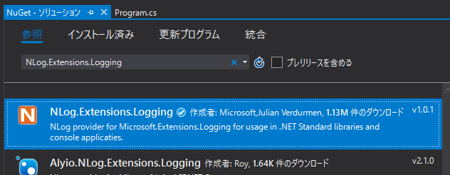
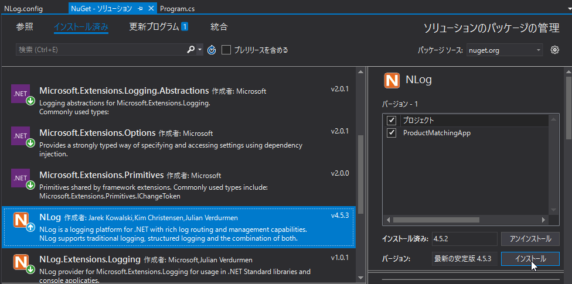

第8章 エラーに備えよう
=====

[↑目次](../README.md "目次")

[← 第7章 2つのファイルを使って処理してみよう](07.md "第7章 2つのファイルを使って処理してみよう")

これまでデータの入出力、データ構造、アルゴリズムを組み合わせ、複雑な処理を行う方法を学んできました。しかし、まだデータが正しく、ファイルが存在する前提でしかうまく動きません。

アプリケーションの動作の中で、想定している/していないにかかわらず、エラーへの対応は必要不可欠です。本章では、どのようにエラーに対処すればよいのか学んでいきましょう。


エラーの分類
-----

まずはエラーの種類について理解しておきましょう。アプリケーションにおけるエラーは、主に次の２つに分類できます。

- 業務エラー  
- システムエラー

### 業務エラー

アプリケーションの仕様で事前に想定していて、発生してもやり直しが可能なエラーは「業務エラー」と呼びます。例えば、入力ファイル名の間違いや、ファイルのデータ形式の不一致などが考えらます。

業務エラーが発生した場合は、発生したエラーの内容と、可能ならエラーを解消するための手段をユーザーに伝え、再度やり直してもらうよう促す必要があります。

### システムエラー

アプリケーションの仕様では想定されておらず、発生するとやり直しができないエラーは「システムエラー」と呼びます。例えば、ディスク容量がいっぱいになったり、OSの動作が不安定になったりといったものが考えられます。

システムエラーが発生した場合は、そのエラーの詳細情報を管理者のために残しておき、ユーザーには想定外の事態が起きたことだけを伝え、管理者に調査を依頼するよう促す必要があります。


エラーの通知方法
-----

次に、それぞれのエラーをどのようにユーザーに通知するかについて考えましょう。

バッチアプリケーションでエラーを通知する方法としては、主に次の方法があります。順にみていきましょう。

- 標準エラー出力
- エラーログ
- 終了ステータス

### 標準エラー出力

標準出力のように、コンソール上にエラー内容を出力するための仕組みが「標準エラー出力」です。実行すると、コンソール上に出力されるように見えるのは標準出力と同じです。ただ、標準出力とは別のルートでコンソールに出力されているので、標準出力を使った処理とは混ざらないようにできています。

例えば、コンソールアプリケーションを実行する際、次のように`>`記号に続けてファイル名を指定すると、そのファイルに標準出力の内容が書き出されます。これをリダイレクトと呼びます。

```
> someApp.exe > output.txt
```

しかし、前述の通り標準エラー出力の内容は標準出力とはルートが違うので、ファイルにその内容は書き出されません。無理やり書き出したい場合は、次のように`2>`のように標準エラー出力のリダイレクト先を指定します。

```
> someApp.exe > output.txt 2> error.txt
```

ちなみに、標準出力のリダイレクトは`1>`でも可能です。既定のリダイレクト元が標準出力になっているので、`1`を省略できているにすぎません。

【参考】標準エラー出力をファイルへ出力 - リダイレクトとパイプ - コマンドプロンプトの使い方
https://www.adminweb.jp/command/redirect/index3.html

では、標準エラー出力をどのようなときに使えばよいかというと、処理結果を標準出力で出力するようなアプリケーションの場合は、エラー内容は標準エラー出力を使って出力するのが自然でしょう。

C#で標準エラー出力を扱うには、`Console`クラスの`Error`プロパティ(`TextWriter`型)を使い、`WriteLine`メソッドなどを利用して出力します。

```csharp
Console.Error.WriteLine("エラー！");
```

### エラーログ

標準エラー出力はリダイレクトしてファイルに残さなければ、そのまま消えてしまいます。そうならないよう、初めから外部のファイルなどにエラー内容を出力する方法もあります。それが「エラーログ」です。

ログ(log)とは「記録」という意味で、その名の通りアプリケーションの動作について記録することを言います。記録先はこれまで扱ってきたテキストファイルだけでなく、Windowsの「イベント ログ」のようなログ管理基盤やネットワークの向こうにあるログ収集サービスに登録したり、各種の「データ」を専門に管理する「データベース」に保管したりと様々です。

エラー内容の出力先としては、ログは最も一般的なものです。しかし前述のとおり、出力先は柔軟に設定できる必要もあり、自分で直接ファイルを読み書きするのはお勧めできません。各言語、動作プラットフォームに用意された、ログ記録用の仕組みを使うのがよいでしょう。

C#におけるログ出力方法については、後程詳しく説明します。


### 終了ステータス

バッチアプリケーションを実行した結果、そもそもエラーがあったのかどうかを判定しなければなりません。そのための仕組みが「終了ステータス」です。

Windowsをはじめ各種のOSではアプリケーションは1つの「プロセス」として実行されます。終了ステータスとは、このプロセスが終了した際の状態を、整数で扱えるようにした仕組みです。一般的には、正常終了時は0、それ以外はアプリが任意で指定することになっています。

Windowsでは、終了ステータスは`ERRORLEVEL`環境変数に設定されます。環境変数とは、OSが提供する情報共有のための仕組みで、Windowsは`set`コマンドで設定し、`%環境変数名%`で取得できます。

```
> set SOME_VALIABLE=Hello
> echo %SOME_VALIABLE%
Hello
```

これを利用し、バッチアプリケーションを実行した直後に`ERRORLEVEL`環境変数を確認することで、エラーの有無を判定できます。

```
> someApp.exe
> if "%ERRORLEVEL%"=="0" (
      echo Success
  ) else (
      echo Failure
  )
```


C#では、終了ステータスは`Main`メソッドの戻り値を使って扱えます。既定では`void`となっている`Main`メソッドの戻り値の型を、`int`型に変更し、エラーがあれば`return 0以外の整数;`、エラーがなければ`return 0;`で終了すればOKです。

```csharp
static int Main(string[] args)
{
    // ... 処理

    if (hasError)
    {
        // エラーあり
        return 1;
    }

    // 正常終了
    return 0;
}
```

実践的な使い方は、この後学んでいきましょう。


バッチアプリケーションにおけるエラー処理
-----

それでは、前章で作成した`ProductMatchingApp`に、実際にエラー処理を組み込んでいきましょう。

### エラー処理方針

最初にどのようにエラーを処理するか方針を決めておきましょう。

#### エラー有無の通知方法

まず、エラーがあった場合の通知方法を決めましょう。前述のとおり、エラー有無は「終了ステータス」で表すの一般的ですのでそれに倣います。

エラーの内容は別途確認することとしましょう。したがって、エラーの有無だけが判定できれば良いので、終了ステータスの値は「0(えらーなし)」、「1(エラーあり)」とします。

#### エラー内容の出力方法

対象とするアプリケーションでは、処理対象のデータをファイルで入出力します。したがって、今回は標準エラー出力ではなく、ログにエラーの内容を出力することにしましょう。ログ出力先は`error.csv`というテキストファイルにCSV形式で出力することとします。

前述のとおり、ログ出力は専用の仕組みを利用することで、出力先などを柔軟に構成できます。今回はMicrosoft謹製のライブラリ「Microsoft.Extensions.Logging」と、OSSのロギングライブラリ「NLog」を組み合わせて使いましょう。

これらのライブラリはNuGetでインストールできます。前章のCSV helperと同じ要領で、NuGetパッケージ「NLog.Extensions.Logging」をインストールしてください。このパッケージは「Microsoft.Extensions.Logging」と「NLog」への依存関係を含んでいるため、関連するパッケージが一度にインストールされます。



図8-1 ロギングNuGetパッケージのインストール

依存関係のあるパッケージは最新バージョンではない場合があるので、丸に上向き矢印のアイコンがついていたら、［インストール］ボタンをクリックして最新バージョンにアップデートしてください。



図8-2 パッケージのアップデート

#### エラー検知と処理方法

最後にどのようにエラーをどのように検知して処理するかについて検討しましょう。

前述のとおり、エラーは「業務エラー」と「システムエラー」に分けられます。そして、おおざっぱに言えば、「業務エラー」でないエラーはすべて「システムエラー」です。

##### 業務エラー

業務エラーは「想定済み」のエラーですので、通常の`if`文などで判定できます。`Main`メソッドから呼び出している各メソッドでそれぞれエラーチェックを行い、エラーの有無による分岐は`Main`メソッドで行うようにすることで、見通しの良いプログラムとなります。

今回は入力ファイルが存在するかどうか、対象データが0件ではないかについて判定し、業務エラーとして扱うことにしましょう。

##### システムエラー

C#ではシステムエラーについては「例外」という仕組みで取り扱うことができます。例外は`Exception`クラスおよびそのサブクラスのオブジェクトが、発生元から「スロー」され、それを`try-catch`構文で処理するというのが一般的です。

しかし、`try-catch`構文で漏れなく例外を処理するのは、思いのほか簡単ではありません。どうしても「漏れ」が出てきてしまいますし、中には`try-catch`構文で捕捉できない例外というものも存在します。したがって、よほどの特殊な事情がない限りは、**例外を`try-catch`構文で処理してはいけません**。

その代わり、例外を漏れなく処理するためには「集約例外ハンドラー」を導入します。集約例外ハンドラーの役目はサッカーのゴールキーパーのようなもので、飛んできた「例外」というボールをすべて処理します。


### `Main`メソッドの戻り値変更

それでは、実際にコードの修正に入りましょう。まず、エラー有無を終了ステータスで表すため、`Main`メソッドの戻り値の型を`int`型に変更します。

リスト8-1 `Main`メソッドの戻り値変更

```csharp
static int Main(string[] args)
{
    // ... 略

    // 正常終了
    return 0;
}
```

戻り値の型変更に伴い、`Main`メソッドには`return`文が必須になります。メソッドの最後に正常終了を表すように`return 0;`を追加しましょう。

### ログ出力設定

今度はログ出力のための設定を行いましょう。必要な作業は、次の2つです。

1. 設定ファイル作成
2. ロガー作成

順にみていきましょう。

#### 設定ファイル作成

今回はログ出力ライブラリにNLogを使うため、NLog用の設定ファイルが必要です。設定ファイルには、ログをどこにどんな形式で出すか、出力するログの種類は何か、といった情報を記載します。

NLogの設定ファイルは、既定では`NLog.config`という名前のXMLファイルを使います。プロジェクトに新しい項目として`NLog.config`XMLファイルを作成し、ビルド時に「新しい場合はコピーする」よう設定しましょう。


図8-3 `NLog.xml`の作成

`NLog.config`XMLファイルは、[NLogの公式チュートリアル](https://github.com/NLog/NLog/wiki/Tutorial#configure-nlog-targets-for-output)を参考に、次のように入力してください。

リスト8-2 `NLog.config`XMLファイル

```xml
<?xml version="1.0" encoding="utf-8" ?>
<nlog xmlns="http://www.nlog-project.org/schemas/NLog.xsd"
      xmlns:xsi="http://www.w3.org/2001/XMLSchema-instance">
    <targets>
        <!--
            ログ出力先(ターゲット)の定義
                name     : ターゲットの名前
                xsi:type : 出力先の種類
                filename : 出力先ファイル名
                layout   : ログの書式
                    ${longdate}  : 長い形式の日時
                    ${message}   : ログメッセージ
                    ${exception} : 例外
                        format=tostring : 例外を`ToString`メソッドを読んだ形で出力
        -->
        <target name="errorLogFile" xsi:type="File" fileName="error.csv"
            layout='${longdate},"${message}","${exception:format=tostring}"' />
    </targets>
    <rules>
        <!--
            何をどこに出力するかのルール設定
                name     : ルール名
                minlevel : デバッグ(Debug)用～申告なエラー用(Fatal)までどのログ以上を出すかの指定
                    Error: エラーログ以上を出力
                writeTo  : 出力先ターゲット名
        -->
        <logger name="*" minlevel="Error" writeTo="errorLogFile" />
    </rules>
</nlog>
```

なお、ログ出力レイアウト指定の際、CSV形式で出力する都合で`"`(ダブルクォーテーション)を指定しなければなりません。そのため、`leyout`属性は`'`(シングルクォーテーション)で囲うようにしています。

#### ロガー作成

ログ出力設定ができたので、後はアプリ内でログ出力できるよう、「ロガー」を作成します。

ログ出力はあらゆるところで行う可能性があるため、ロガーはクラスフィールドとして定義し、同時に初期化も行ってしまいます。

リスト8-3 ロガー定義と初期化

```csharp
// ... 略

// ログ出力ライブラリの名前空間をインポート
using Microsoft.Extensions.Logging;
using NLog.Extensions.Logging;

namespace ProductMatchingApp
{
    class Program
    {
        // ロガー作成
        private readonly static ILogger logger = new LoggerFactory()
                .AddNLog()
                .CreateLogger<Program>();

        static int Main(string[] args)
        {
            // ... 略
        }

        // ... 略
    }
}
```

Microsoft.Extensions.Loggingでは、ロガーを作るために`LoggerFactory`クラスを使います。`LoggerFactory`クラスのオブジェクトに対して、各種の`Add～`メソッドを連ねることで、ログ出力先を柔軟に付け外しができます。今回は`NLog.Extensions.Logging`パッケージに含まれる`AddNLog`メソッドを呼び出し、NLogを使うことを宣言します。

その後、`LoggerFactory`クラスの`CreateLogger<T>`メソッドを呼び出すことで、`Add～`で指定した出力先に一度に出力可能なロガーを作成できます。`T`型引数にはログ出力を行うクラス名を指定することで、そのクラス専用のロガーであることを明示します。このクラス名はログに出力することも可能です。


### システムエラーへの対応

システムエラーへの対応のほうが簡単なので、まずそちらから片付けましょう。

システムエラーには前述のとおり「集約例外ハンドラー」で対応します。コンソールアプリケーションの場合、集約例外ハンドラーは`AddDomain.CurrentDomain.UnhandledException`イベントハンドラーとして定義します。

リスト8-4 集約例外ハンドラー設定

```csharp
static int Main(string[] args)
{
    // 集約例外ハンドラーの設定
    AppDomain.CurrentDomain.UnhandledException += (sender, e) =>
    {
        var ex = e.ExceptionObject as Exception;
        logger.LogCritical(ex, "想定外のエラーが発生しました。管理者に連絡してください。");
    };

    // テストのため人為的に例外を発生させる
    var a = 0;
    var b = 2 / a;

    var productDictionary = ImportProduct();

    // ... 略
}
```

詳しくは説明しませんが、.NETによるWindowsアプリケーションは、プロセスの中にさらに`AppDomain`(アプリケーションドメイン)と呼ばれる隔離された空間を作り、その中で動作します。上記のコードは、現在アプリケーションが動作している`AppDomain`で発生した例外をすべて補足して処理します。

発生した例外は、`UnhandledException`イベントハンドラーのイベント引数`e`(`UnhandledExceptionEventArgs`型)の`ExceptionObject`プロパティを`Exception`型にキャストすることで取得できます。

取得した例外オブジェクトは、ロガーの`LogCritical`メソッドに渡してログに出力します。システムエラーが発生した場合のログメッセージは、深刻なエラーが発生したと伝えるにとどめ、詳細は例外の内容を見てもらうようにするのが通例です。

テスト実行すると、`var b = 2 / a;`の行でゼロ除算例外が発生し、`ProductMatchingApp.exe`と同じところに作成された`error.csv`に、発生した例外の内容が出力されます。

```
2018-04-18 16:48:04.3534,"想定外のエラーが発生しました。管理者に連絡してください。","System.DivideByZeroException: 0 で除算しようとしました。
   場所 ProductMatchingApp.Program.Main(String[] args) 場所 C:\Users\takano-s\Documents\Visual Studio 2017\Projects\ProductMatchingApp\ProductMatchingApp\Program.cs:行 34"
```

なお、例外が発生した場合、`ERRORLEVEL`環境変数には0や1以外の値が設定されます。そのため、特に`return 1;`というコードを書く必要はありません。


### 業務エラーへの対応

次に業務エラーに対応していきましょう。

業務エラーは`Main`メソッドから呼ばれる各処理用の個別メソッド内で行うこととするのでした。しかし、エラーが発生した場合、終了ステータスを`1`としなければならないため、そのためには`Main`メソッドにて`return 1;`をする必要があります。

そこで、まず各処理用メソッドが成功したか否かを表す列挙体を作成しましょう。

リスト8-5 処理結果用列挙体

```csharp
enum Result
{
Success,
Failure
}
```

今度は各処理用メソッドから成功したか否かも、処理結果と一緒に戻さなければいけません。そのため、メソッドの戻り値をタプルにします。例として、商品データ取り込みを行う`ImportProduct`メソッドを見てみましょう。

リスト8-6 処理用メソッドから結果を返す

```csharp
static int Main(string[] args)
{
    // ... 略

    var (productDictionary, importProductResult) = ImportProduct();
    if (importProductResult != Result.Success)
    {
        return 1;
    }

    // ... 略
}

private static (Dictionary<string, Product>, Result) ImportProduct()
{
    const string productFilePath = @".\product.csv";

    // 商品データCSVファイルを読み込むためのStreamReaderオブジェクト作成
    using (var sr = new StreamReader(productFilePath, Encoding.UTF8))
    {
        // CSV helperで読み込み
        var csv = new CsvReader(sr);
        var products = csv.GetRecords<Product>();

        // ディクショナリに変換
        var dic = products.ToDictionary(product => product.Code);

        return (dic, Result.Success);
    }
}
```

最後に、業務エラーチェックを行い、エラーがあればログに出力するようにしましょう。

リスト8-7 業務エラーチェック

```csharp
private static (Dictionary<string, Product>, Result) ImportProduct()
{
    const string productFilePath = @".\product.csv";

    // 商品デVータCSVファイルがなければエラー
    if (!File.Exists(productFilePath))
    {
        // エラー内容をログに出力する
        logger.LogError($"商品データCSVファイル<{productFilePath}>がありません。");
        return (null, Result.Failure);
    }

    // 商品データCSVファイルを読み込むためのStreamReaderオブジェクト作成
    using (var sr = new StreamReader(productFilePath, Encoding.UTF8))
    {
        // ... 略
    }
}
```

エラーログは、`logger`クラスフィールドの`LogError`メソッドを使って出力します。

同様に`MatchProduct`メソッドの戻り値も、`Result`列挙体を使うよう変更し、商品コードが存在するかどうかチェックを行うようにすると、次のコードのようになります。

リスト8-8 エラー対応後の商品情報マッチング処理
```csharp
static int Main(string[] args)
{

    // ... 略

    var productSales = ImportSales();

    var matchProductResult = MatchProduct(productDictionary, productSales);
    if (matchProductResult != Result.Success)
    {
        return 1;
    }

    // ... 略

    // 正常終了
    return 0;
}

private static Result MatchProduct(Dictionary<string, Product> productDictionary, List<ProductSales> productSales)
{
    bool hasError = false;

    // インデックス付きで列挙
    foreach (var (item, i) in productSales.Select((x, i) => (x, i)))
    {
        // 対応する商品情報を取得
        if (productDictionary.TryGetValue(item.ProductCode, out var product))
        {
            // 商品情報を商品版倍データに設定
            item.ProductName = product.Name;
            item.ProductCategory = product.Category;
        }
        else
        {
            // 商品が見つからなければエラー
            logger.LogError($"販売データ {i + 1} 行目 | 商品コード<{item.ProductCode}>に該当する商品が見つかりませんでした。");
            hasError = true;
        }
    }

    if (hasError)
    {
        return Result.Failure;
    }
    else
    {
        return Result.Success;
    }
}
```

このコードをビルドし、`product.csv`ファイルを消して実行したり、`sales.csv`に`product.csv`にない商品コードのレコードを追加したりして実行すると、エラーログを確認できます。

```
2018-04-19 09:34:41.1813,"商品データCSVファイル<.\product.csv>がありません。",""
2018-04-19 14:02:12.1127,"販売データ 2 行目 | 商品コード<0005>に該当する商品が見つかりませんでした。",""
2018-04-19 14:02:12.1417,"販売データ 4 行目 | 商品コード<0004>に該当する商品が見つかりませんでした。",""
```


演習問題
-----

1. 販売データCSVファイル`product.csv`がなかった場合、業務エラーとして扱うようにしてみよう
2. 結果データCSVファイル`result.csv`が既に存在した場合、業務エラーとして扱うようにしてみよう


- - - - -

エラーも扱えるようになったので、次の章では最後にデータを集計するアルゴリズムについて学びましょう。

[→ 第9章 データを集計してみよう](09.md "第9章 データを集計してみよう")