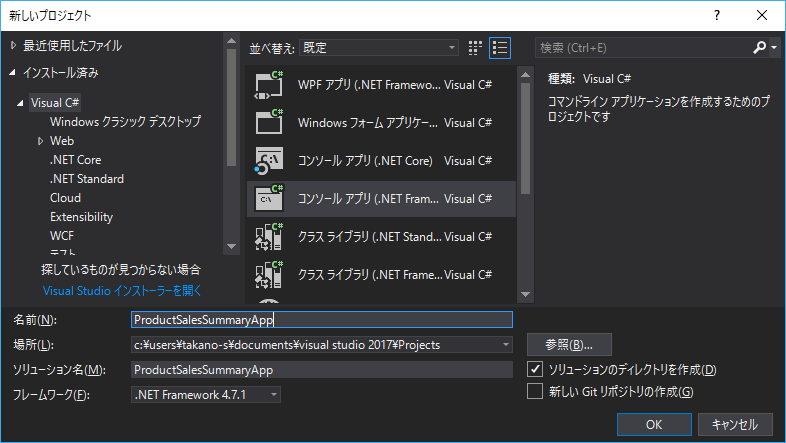
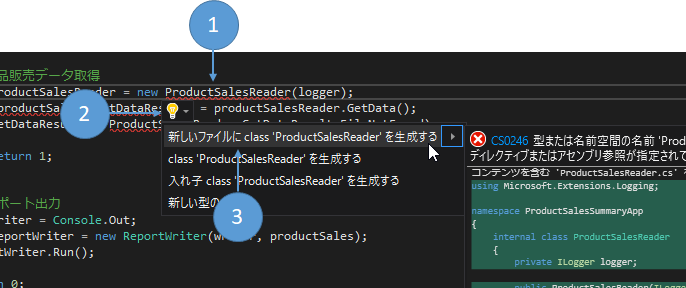
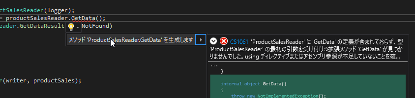
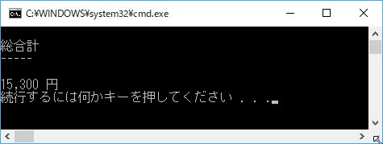
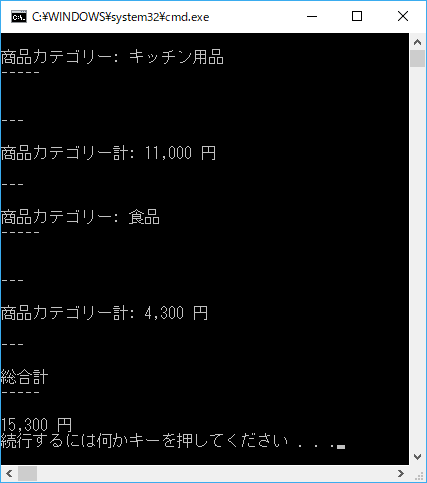
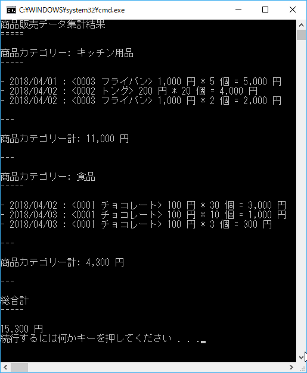

第9章 データを集計してみよう
=====

[↑目次](../README.md "目次")

[← 第8章 エラーに備えよう](08.md "第8章 エラーに備えよう")

前章まででバッチアプリケーションを作る際に必要な一通りのことを学んできました。本テキストの最後に、これまでの内容を生かしつつ、データを集計するアプリケーションを作成してみましょう。


作成するアプリ
-----

第7章で作成したアプリケーションの結果の商品販売データを入力として、金額を集計して標準出力に結果を出力します。

- 入力ファイル: 商品販売データCSV `product_sales.csv`
    - 項目
        - 販売日
        - 商品コード
        - 商品名
        - 商品カテゴリー
        - 単価
        - 数量
        - 金額
    - ファイル形式: CSV
        - 文字コード：BOM付きUTF-8
        - 改行コード：CRLF
    - データ順
        - 販売日、商品カテゴリー、商品コードの昇順
- 集計条件
    - 全金額合計
    - 商品カテゴリー別金額合計
- 出力形式
    - [Markdown形式](https://ja.wikipedia.org/wiki/Markdown)で出力する
        - 商品カテゴリーごとに集計する
            - 商品カテゴリーの昇順で出力する
        - 明細レコードは販売日、商品コード順で出力
        - 最後に全商品金額合計を出力

### 出力例

```markdown
商品販売データ集計結果
=====

商品カテゴリー: (商品カテゴリー)
-----

- (販売日:yyyy/MM/dd) : <(商品コード) (商品名)> (単価:##,##0.##) 円 * (数量:###,##0) 個 = (金額:#,###,##0) 円

---

商品カテゴリー計: #,###,##0 円

---

商品カテゴリー: 食品
-----

- 2018/04/01 : <0001 〇〇キャンディ> 100 円 * 100 個 = 10,000 円
- 2018/04/02 : <0002 △△ガム> 30 円 * 10 個 = 300 円
- 2018/04/04 : <0001 〇〇キャンディ> 100 円 * 700 個 = 70,000 円
- 2018/04/20 : <0001 〇〇キャンディ> 105 円 * 200 個 = 21,000 円

---

商品カテゴリー計: 101,300 円

---

総合計
-----

251,300 円
```


プロジェクト作成
-----

では、さっそくアプリ作成に入りましょう。まずはいつものようにコンソールアプリケーションプロジェクトを新たに作成します。プロジェクト名は`ProductSalesSummaryApp`としましょう。



図9-1 新しいプロジェクトの作成

作成したプロジェクトには、第7章、第8章と同じ要領で「CSV helper」、「NLog.Extensions.Logging」パッケージをインストールします。


処理の流れの実装
-----

次に`Main`メソッドに対して、アプリの処理の流れがざっくりと実装していきましょう。

今回のアプリでは、

1. 商品販売データ取得
3. レポート出力

という流れになります。集計処理については、今回の出力対象となるレポートに依存する処理になるので、レポート出力処理に含めることとしましょう。

エラー処理や戻り値の型の変更と併せると、`Main`メソッドは次のようになります。

リスト9-1 `Main`メソッドの流れ

```csharp
class Program
{
    private readonly static ILogger logger = new LoggerFactory()
        .AddNLog()
        .CreateLogger<Program>();

    static int Main(string[] args)
    {
        // 集約例外ハンドラーの設定
        AppDomain.CurrentDomain.UnhandledException += (sender, e) =>
        {
            var ex = e.ExceptionObject as Exception;
            logger.LogCritical(ex, "想定外のエラーが発生しました。管理者に連絡してください。");
        };

        // 商品販売データ取得

        // レポート出力

        return 0;
    }
}
```

このように処理の大まかな流れを先にコメントで書くようにすると、「何」を実装していかないといけないのかが明確となり、進捗度合いも測りやすくなるためお勧めです。


商品販売データの取得
=====

それでは、`Main`メソッドの個別処理を順に実装していきましょう。まずは商品販売データの取得から始めます。

商品販売データの取得処理自体は、第7、8章で行ったCSVデータの読み込み処理とほぼ変わりません。しかし、すべてを`Program`クラスに書いてしまうと、クラスの規模が大きくなり、だんだんとどこに何があるのかわからなくなっていってしまいます。

そこで、今回は「データの取得処理を行う専用のクラス」を作成してみましょう。 こういった「一つのことをうまくやる」モジュールを組み合わせていくと、1つの変更がほかの個所に影響を及ぼすことがなくなるため、作業範囲も明確になり、保守のしやすさが高まります。これを「単一責務の原則(SRP：**S**imgle **R**esponsibility **P**rinciple)」と呼び、最も基本的なプログラムの設計原則の一つとして知られています。

では、どのようにクラスを設計すればよいでしょうか？こんな時は、使い方から考えることで、使いやすいクラスを設計できます。

商品販売データ取得処理にやってほしいことは、どこかにあるCSVファイルからデータを読み込み、商品販売データのコレクションとして返すことです。また、データ取得対象のCSVファイルがない場合などのエラーもチェックして、ログ出力と結果を戻してほしいです。

そこで、次のように`Main`メソッドに書いてみましょう。

リスト9-2 商品販売データ取得処理の使い方

```csharp
static int Main(string[] args)
{
    // ... 略

    // 商品販売データ取得
    var productSalesReader = new ProductSalesReader(logger);
    var (productSales, getDataResult) = productSalesReader.GetData();
    if (getDataResult != ProductSalesReader.GetDataResult.NoError)
    {
        return 1;
    }


    // ... 略
}
```

クラスを作成する際のポイントとして、必要な情報はできるだけコンストラクター引数で渡すようにし、メソッド呼び出しではあまり引数を使わないようにするとよいでしょう。今回は、ロガーの変数をコンストラクター引数で渡し、データ取得処理の引数はなしにしました。

### クラスの生成

ここまでコードを入力すると、当然まだクラスがないのでビルドエラーになります。しかし、Visual Studioはこの状態から必要なクラスを自動で作ってくれる機能があります。実際にやってみましょう。

1. `new ProductSalesReader(logger);`の個所にカーソルを移動する
2. `Ctrl` + `.`キーを押すか電球アイコンをクリックして「クイックアクションとリファクタリング」を実行する
3. ［新しいファイルに class 'ProdutSalesReader'を生成する］をクリックする




図9-2 クラスの生成

すると、`ProductSalesReader.cs`ファイルに次のコードが生成されます。

リスト9-3 生成された`ProductSalesReader.cs`

```csharp
using Microsoft.Extensions.Logging;

namespace ProductSalesSummaryApp
{
    internal class ProductSalesReader
    {
        private ILogger logger;

        public ProductSalesReader(ILogger logger)
        {
            this.logger = logger;
        }
    }
}
```

ロガー用の`private`なインスタンス変数`logger`も定義され、コンストラクターで引数から代入されるのが分かります。


### 処理結果の型の作成

今度はメソッド戻り値を見ていきましょう。メソッドの戻り値は、商品販売データクラスと処理結果の2つです。このうち前者の商品販売データクラスは、第7、8章と名前空間以外は同じもので大丈夫です。

リスト9-4 商品販売データクラス

```csharp
using System;

namespace ProductSalesSummaryApp
{
    class ProductSales
    {
        /// <summary>
        /// 商品コード
        /// </summary>
        public string ProductCode { get; set; }

        /// <summary>
        /// 商品名
        /// </summary>
        public string ProductName { get; set; }

        /// <summary>
        /// 商品カテゴリー
        /// </summary>
        public string ProductCategory { get; set; }

        /// <summary>
        /// 単価
        /// </summary>
        public decimal UnitPrice { get; set; }

        /// <summary>
        /// 数量
        /// </summary>
        public decimal Quantity { get; set; }

        /// <summary>
        /// 金額
        /// </summary>
        public decimal Amount { get; set; }

        /// <summary>
        /// 販売日
        /// </summary>
        public DateTime SalesDate { get; set; }
    }
}
```

もう一つの処理結果については、やはり第7章、8章のように列挙体として定義しましょう。ただ、より処理との結びつきを強く表すため、`ProductSalesReader`クラスの内部列挙体として定義します。

リスト9-5 商品販売データ取得処理結果

```csharp
internal class ProductSalesReader
{
    public enum GetDataResult
    {
        FileNotFound,
        NoError
    }

    // ... 略
}
```

これでようやく商品販売データ取得処理メソッドの作成に入れます。

### データ取得メソッド作成

データ取得メソッドはVisual Studioによって生成後に手を加えて行きます。

まず、クラスの生成と同様にクイックアクションからメソッドを生成します。



図9-3 メソッドの生成

生成されたコードは次のように、戻り値が`object`型になり、またアクセス修飾子も`internal`になります。

リスト9-6 生成直後の`GetData`メソッド

```csharp
internal object GetData()
{
    throw new NotImplementedException();
}
```

今度はアクセス修飾子を`public`にし、戻り値をタプルにしましょう。

リスト9-7 シグネチャの変更

```csharp
public (IEnumerable<ProductSales>, GetDataResult) GetData()
{
    throw new NotImplementedException();
}
```

最後に、第7章を参考にCSVファイルを読み込むようにコードを書いて終わりです。

リスト9-8 CSVファイルを読み込むよう変更

```csharp
public (IEnumerable<ProductSales>, GetDataResult) GetData()
{
    const string inputFilePath = @".\product_sales.csv";

    if (!File.Exists(inputFilePath))
    {
        // ファイルなし
        logger.LogError($"商品販売データCSVファイル<{inputFilePath}>がありません。");
        return (null, GetDataResult.FileNotFound);
    }

    using (var streamReader = new StreamReader(inputFilePath, Encoding.UTF8))
    {
        var csvReader = new CsvReader(streamReader);
        var productSales = csvReader.GetRecords<ProductSales>().ToArray();

        if (productSales.Any())
        {
            // データあり
            return (productSales, GetDataResult.NoError);
        }
        else
        {
            // データなし
            logger.LogError($"商品販売データCSVファイル<{inputFilePath}>にデータがありません。");
            return (null, GetDataResult.DataIsEmpty);
        }
    }
}
```

なお、`GetRecords<T>`メソッドの後に`ToArray`メソッドを呼び出しているのは、レポート出力時の並び替えや集計に備え、データを全部読み込んでおくためです。また、その際、データの要素の数は変動しないので、`ToList`メソッドリストにするのではなく、配列にしています。


レポート出力
-----

出力対象データが取得できたので、今度はレポート出力処理に入っていきましょう。

データ取得処理と同様に、レポート出力処理を行うクラスについても`Main`メソッドに使い方を書いていきましょう。

リスト9-9 レポート出力の使い方

```csharp
// レポート出力
var writer = Console.Out;
var reportWriter = new ReportWriter(writer, productSales);
reportWriter.Run();
```

レポートを出力する「責務」を持つクラスなので、クラス名は`ReportWriter`としました。

レポート出力は今回は標準出力に出力しますが、テキストファイルへの出力でも同じ処理が使えるため、出力先として`TextWriter`型のオブジェクトをコンストラクター引数で渡します。`Console`クラスの`Out`プロパティを使うと、標準出力用のオブジェクトを`TextWriter`型で取得できるので、これを使います。今後ファイル出力もしたいとなったら、`TextWriter`型を継承した`StreamWriter`型のオブジェクトを作成して渡してやれば、これで流用できます。


### クラスの生成

`ProductSalesReader`クラスと同様に、`ReportWriter`クラスも生成してみましょう。次のように生成されるはずです。

リスト9-10 生成された`ReportWriter`クラス

```csharp
using System.Collections.Generic;
using System.IO;

namespace ProductSalesSummaryApp
{
    internal class ReportWriter
    {
        private TextWriter writer;
        private IEnumerable<ProductSales> productSales;

        public ReportWriter(TextWriter writer, IEnumerable<ProductSales> productSales)
        {
            this.writer = writer;
            this.productSales = productSales;
        }
    }
}
```

### `Run`メソッドの生成

続いて、`Run`メソッドを生成しましょう。

リスト9-11 生成された`Run`メソッド

```csharp
internal void Run()
{
    throw new NotImplementedException();
}
```

`ProductSalesReader`クラスの`GetData`メソッドと同様に、アクセス修飾子は`public`にしておきましょう。

リスト9-12 アクセス修飾子の変更

```csharp
public void Run()
{
    throw new NotImplementedException();
}
```

### 出力対象データの並び替え

レポートは「商品カテゴリー別」に集計し、明細データを「販売日、商品コードの昇順」に出力することから、出力対象データを「商品カテゴリー、販売日、商品コードの昇順」に並び替える必要があります。

データの並び替えは第7章と同様に、LINQのクエリ式を使って行いましょう。

リスト9-12 出力対象データの並び替え

```csharp
public void Run()
{
    var orderedProductSales = SortProductSales(productSales);
}

private IEnumerable<ProductSales> SortProductSales(IEnumerable<ProductSales> productSales)
{
    return from item in productSales
           orderby item.ProductCategory, item.SalesDate, item.ProductCode
           select item;
}
```     

### 集計対象値を保持する内部クラス作成

次にデータの集計に入ります。今回の集計対象は、商品カテゴリー別金額合計、全金額合計の2つでしたね。これら2つをそれぞれ変数として宣言してもよいのですが、集計対象が増えると管理が大変になるので、集計対象値を含む内部クラスとして定義しましょう。

リスト9-13 集計対象値のクラス

```csharp
internal class ReportWriter
{
    private class ProductSalesSummary
    {
        public decimal TotalAmount = 0;
        public decimal CategoryAmount = 0;
    }

    // ... 略
}
```

集計対象値のクラスは`ReportWriter`クラスでしか使わないので、アクセス修飾子は`private`にしておきます。また、集計対象値をあらわすフィールドは0で初期化しておきます。

### 全金額合計の集計

下準備がそろったので、まず簡単な全金額合計を集計しましょう。といっても、対象データをforeachで列挙して、その金額を繰り返し加算していくだけです。

集計結果はデータ出力例のように出力する専用メソッドを作成し、標準出力に出力します。

リスト9-14 全金額集計

```csharp
public void Run()
{
    var orderedProductSales = SortProductSales(productSales);

    var summary = new ProductSalesSummary();

    foreach (var item in orderedProductSales)
    {
        summary.TotalAmount += item.Amount;
    }

    WriteTotalAmount(summary);
}

private void WriteTotalAmount(ProductSalesSummary summary)
{
    writer.WriteLine("");
    writer.WriteLine($"総合計");
    writer.WriteLine("-----");
    writer.WriteLine("");
    writer.WriteLine($"{summary.TotalAmount:#,##0.#} 円");
}
```

この時点で、以下の`product_sales.csv`ファイルを用意して実行してみましょう。

`product_sales.csv`

```
ProductCode,ProductName,ProductCategory,UnitPrice,Quantity,Amount,SalesDate
0003,"フライパン",キッチン用品,1000,5,5000,2018/04/01
0002,"トング",キッチン用品,200,20,4000,2018/04/02
0003,"フライパン",キッチン用品,1000,2,2000,2018/04/02
0001,チョコレート,食品,100,30,3000,2018/04/02
0001,チョコレート,食品,100,10,1000,2018/04/03
0001,チョコレート,食品,100,3,300,2018/04/03
```

結果は次の通りです。



図9-4 全金額合計の集計結果


### 商品カテゴリー別金額合計の集計

次に商品カテゴリー別金額合計の集計に移りましょう。考え方は次の通りです。

- 0に初期化する
- 商品カテゴリーが前のレコードと同じなら加算する
- 商品カテゴリーが前のレコードと違ったらそれまでの集計地を出力し、0に初期化する

この考え方は、前後のレコードの「キー」情報の関係性が「壊れる」のを検知して行うことから、「キーブレイク処理」と呼ばれます。

まず、前後のキー情報を格納するための変数を宣言します。

リスト9-15 キーブレイク処理用の変数宣言

```csharp
public void Run()
{
    var orderedProductSales = SortProductSales(productSales);

    var summary = new ProductSalesSummary();

    var newProductCategory = "";
    var oldProductCategory = "";

    // ... 略
}
```

ループの内部では、最初に`newProductCategory`に現在処理中のレコードの商品カテゴリーを設定します。その後、`newProductCategory`と`oldProductCategory`と比較し、食い違っているか判定します。

もし食い違っていれば、現在の集計値の出力と初期化、`oldProductCategory`の更新、商品カテゴリー名の出力を行います。なお、1レコード目(`oldProductCategory`が空のとき)はまだ集計を始めていないので、集計値を出力しないよう特別扱いをします。

食い違っていなければ、そのまま素通りし、商品カテゴリー別金額合計に現在のレコードの金額を加算します。

リスト9-16 商品カテゴリー別金額の集計処理

```csharp
public void Run()
{
    // ... 略

    foreach (var item in orderedProductSales)
    {
        newProductCategory = item.ProductCategory;

        if (newProductCategory != oldProductCategory)
        {
            // 商品カテゴリーが変わった
            if (!string.IsNullOrEmpty(oldProductCategory))
            {
                // 1件目でなければカテゴリー別金額合計を出力
                WriteCategoryAmount(summary);
            }

            // 集計値を初期化
            summary.CategoryAmount = 0;

            // キーを更新
            oldProductCategory = newProductCategory;
        }

        summary.CategoryAmount += item.Amount;
        summary.TotalAmount += item.Amount;
    }

    // ループ終了後も最後の商品カテゴリーの集計値を出力
    WriteCategoryAmount(summary);

    // ... 略
}

private void WriteCategoryTitle(string productCategory)
{
    writer.WriteLine("");
    writer.WriteLine($"商品カテゴリー: {productCategory}");
    writer.WriteLine("-----");
    writer.WriteLine("");
}

private void WriteCategoryAmount(ProductSalesSummary summary)
{
    writer.WriteLine("");
    writer.WriteLine("---");
    writer.WriteLine("");
    writer.WriteLine($"商品カテゴリー計: {summary.CategoryAmount:#,##0.#} 円");
    writer.WriteLine("");
    writer.WriteLine("---");
}
```

この時点での実行結果は次の通りです。



図9-5 商品カテゴリー別金額合計の集計結果


### タイトル、明細データの出力

集計は出来たので、あとはタイトルと明細データを出力するだけです。商品販売データの繰り返し処理を始める前にタイトル出力、集計する前に明細データ出力するコードを次のように追加します。

リスト9-17 タイトルと明細データ出力

```csharp
public void Run()
{
    // ...略

    WriteTitle();

    foreach (var item in orderedProductSales)
    {
        // ...略

        WriteItem(item);

        summary.CategoryAmount += item.Amount;
        summary.TotalAmount += item.Amount;
    }

    // ...略
}

private void WriteTitle()
{
    writer.WriteLine("商品販売データ集計結果");
    writer.WriteLine("=====");
}

private void WriteItem(ProductSales item)
{
    writer.WriteLine($"- {item.SalesDate:yyyy/MM/dd} :" +
        $" <{item.ProductCode} {item.ProductName}>" +
        $" {item.UnitPrice:#,###.#} 円 * {item.Quantity:#,###.#} 個 = {item.Amount:#,###.#} 円");
}
```

実行結果は次の通りです。



図9-6 完成版の実行結果


- - - - -

#### [コラム] LINQを使った別解

LINQの機能にはグループ化と集計機能もあります。それを使うと、今回のような処理は次のような簡潔なコードで表せます。

```csharp
public void Run()
{
    var q = from item in productSales
            group item by item.ProductCategory into categoryGroup // カテゴリーでグループ化
            orderby categoryGroup.Key // カテゴリー名でソート
            select  //カテゴリー単位に集計と明細データのソートを行う
            (
                Category: categoryGroup.Key,
                CategoryAmount: categoryGroup.Sum(item => item.Amount),
                ProductSales: from item in categoryGroup
                                orderby item.SalesDate, item.ProductCode
                                select item
            );


    WriteTitle();

    foreach (var categoryItem in q)
    {
        WriteCategoryTitle(categoryItem.Category);

        foreach (var item in categoryItem.ProductSales)
        {
            WriteItem(item);
        }

        WriteCategoryAmount(categoryItem.CategoryAmount);
    }

    WriteTotalAmount(productSales.Sum(item => item.Amount));
}
```

このようにLINQはかなり高機能で便利です。しかし、この処理の内部ではいくつか全権繰り返し処理が隠れており、キーブレイク処理を使った処理に比べると、多少パフォーマンスが落ちるということは覚えておいてください。

ただ、そのパフォーマンス劣化が許容範囲かどうかは、**必ず**処理速度を実際に測って判断しましょう。許容範囲内であれば、ほんのわずかなパフォーマンス向上より、保守のためのコードの可読性のほうが重要になります。

- - - - -


最後に
=====

全9章に渡ってバッチアプリケーションの作り方を学んできました。

本テキストの内容はあくまで導入部分でしかありません。実際のアプリケーションには、もっと複雑なコマンドラインオプションの解析(例えば`--out-file <ファイル名>`で出力ファイル名を指定するなど)や、さらに保守性を高めるための施策などが必要です。こういったものは、今回学んだことの延長線上にありますので、引き続き学んでいってください。

最後に、この先を学ぶのによい参考書籍、Webページなどを提示して本テキストを締めくくります。

- [Adaptive Code ～ C#実践開発手法 第2版](http://ec.nikkeibp.co.jp/item/books/P53540.html)  
  変化へ「適応できる(Adaptive)」プログラムを作成するための手法などが学べます
- [コマンドラインプログラムにおける引数、オプションなどの標準仕様 | プログラマーズ雑記帳](http://yohshiy.blog.fc2.com/blog-entry-260.html)  
  コマンドラインオプションはどうあるべきかについて簡潔にまとまっています
    - [.NET Core 時代のコマンドライン引数解析 - present](https://tnakamura.hatenablog.com/entry/2017/10/24/microsoft-extensions-commandlineutils)  
      .NETアプリケーションでコマンドライン引数を解析するための標準ライブラリの情報が記載されています

演習問題
-----

1. レポートを出力ファイル`.\report.md`に出力するようにしてみよう
2. 商品カテゴリー別集計だけでなく、商品別にも集計を行い、その数量と金額を次のように出力するよう変更してみよう。

- 商品カテゴリー、商品コードごとに集計
    -　商品カテゴリー、商品コードの昇順に出力
- 明細データは販売日の昇順で出力

### 出力例

```markdown
商品販売データ集計結果
=====

商品カテゴリー: (商品カテゴリー)
-----

### 商品: (商品コード) (商品名)
- (販売日:yyyy/MM/dd) : (単価:##,##0.##) 円 * (数量:###,##0) 個 = (金額:#,###,##0) 円
- (販売日:yyyy/MM/dd) : (単価:##,##0.##) 円 * (数量:###,##0) 個 = (金額:#,###,##0) 円

計: (数量:###,##0) 個, (金額:#,###,##0) 円

---

商品カテゴリー計: #,###,##0 円

---

商品カテゴリー: 食品
-----

### 商品: 0001 〇〇キャンディ
- 2018/04/01 : 100 円 * 100 個 = 10,000 円
- 2018/04/04 : 100 円 * 700 個 = 70,000 円
- 2018/04/20 : 105 円 * 200 個 = 21,000 円

計: 1,000 個, 101,000 円

### 商品: 0002 △△ガム
- 2018/04/02 : 30 円 * 10 個 = 300 円

計: 10 個, 300 円

---

商品カテゴリー計: 101,300 円

---

総合計
-----

251,300 円
```
